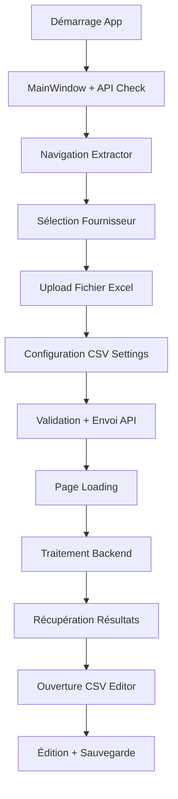

# 🖥️ PLManager Frontend - Documentation Technique

**Version:** 1.0.0  
**Framework:** WPF (.NET Framework 4.8)  
**Architecture:** MVVM Pattern  
**Backend:** PLManager API (Python FastAPI)  
**Langage:** C#

---

## 📋 Table des matières

- [Vue d'ensemble](#vue-densemble)
- [Architecture et structure](#architecture-et-structure)
- [Installation et configuration](#installation-et-configuration)
- [Composants principaux](#composants-principaux)
- [Services et communication API](#services-et-communication-api)
- [ViewModels et logique métier](#viewmodels-et-logique-métier)
- [Pages et navigation](#pages-et-navigation)
- [Workflow complet](#workflow-complet)
- [Gestion des erreurs](#gestion-des-erreurs)
- [Déploiement et maintenance](#déploiement-et-maintenance)

---

## 🎯 Vue d'ensemble

PLManager Frontend est une **application WPF desktop** en **C# .NET Framework 4.8** qui permet de traiter les Packing Lists Excel des fournisseurs et de les convertir en CSV normalisés via une interface moderne.

### Fonctionnalités principales
- **Interface moderne** avec menu latéral et thème sombre
- **Upload et traitement** de fichiers Excel fournisseurs  
- **Configuration des paramètres CSV** (pays, transitaire, importateur)
- **Éditeur CSV avancé** avec grille éditable (SourceGrid)
- **Communication API temps réel** avec le backend Python
- **Gestion multi-fichiers** pour extractions multiples

### Technologies clés
- **WPF + MVVM** pour l'interface et l'architecture
- **HttpClient** pour la communication API
- **SourceGrid** pour l'édition CSV avancée
- **CsvHelper** pour la manipulation CSV
- **ClickOnce** pour le déploiement automatisé

---

## 🏗️ Architecture et structure

### Structure MVVM
```
View (XAML) ↔ ViewModel (C#) ↔ Model (C#) ↔ Service (C#) ↔ API (Python)
```

### Organisation du projet
```
PLManager/
├── App.xaml/.cs                    # Point d'entrée et ressources
├── MainWindow.xaml/.cs             # Fenêtre principale + navigation
├── Pages/                          # Pages de l'application
│   ├── Home.xaml/.cs              # Tableau de bord
│   ├── SelectSupplier.xaml/.cs    # Sélection fournisseur
│   ├── CSVSettingsPage.xaml/.cs   # Configuration CSV
│   ├── Extractor.xaml/.cs         # Page d'extraction
│   ├── LoadingPage.xaml/.cs       # Page de chargement
│   └── CSVEditor*.xaml/.cs        # Éditeurs CSV
├── Services/                       # Services métier
│   ├── ApiService.cs              # Communication API principale
│   ├── ApiClientService.cs        # Client API spécialisé
│   ├── FileUploadService.cs       # Upload de fichiers
│   └── AppState.cs                # État global (Singleton)
├── ViewModels/                     # ViewModels MVVM
│   ├── PackingListViewModel.cs    # ViewModel principal
│   └── SelectSupplierViewModel.cs # ViewModel sélection
├── Model/                          # Modèles de données
├── Helpers/                        # Utilitaires (RelayCommand, Logger, Convertisseurs)
├── Controls/                       # Contrôles personnalisés
├── Themes/                         # Thèmes et styles
└── Resources/                      # Images et ressources
```

---

## 🚀 Installation et configuration

### Prérequis
- **.NET Framework 4.8+**
- **Visual Studio 2019+**
- **Backend PLManager** (Python FastAPI) en fonctionnement

### Configuration API
Modifier l'URL dans `Services/ApiService.cs` :
```csharp
public string BaseApiUrl { get; } = "http://192.168.1.2:8890/api/";
```

### Dépendances NuGet principales
```xml
<PackageReference Include="CsvHelper" Version="33.0.1" />
<PackageReference Include="Newtonsoft.Json" Version="13.0.3" />
<PackageReference Include="SourceGrid" Version="4.4.0" />
<PackageReference Include="MahApps.Metro" Version="2.4.10" />
```

### Déploiement ClickOnce
```xml
<PublishUrl>\\SRV-AZ-FICHIERS\...\PLManager\</PublishUrl>
<UpdateEnabled>true</UpdateEnabled>
<UpdateInterval>7</UpdateInterval>
```

---

## 🪟 Composants principaux

### 1. App.xaml / App.xaml.cs
**Responsabilité :** Point d'entrée et configuration des ressources globales

```xml
<Application StartupUri="MainWindow.xaml">
    <Application.Resources>
        <ResourceDictionary.MergedDictionaries>
            <ResourceDictionary Source="Themes/DarkTheme.xaml"/>
            <ResourceDictionary Source="Assets/Icons.xaml"/>
            <ResourceDictionary Source="Styles/MainStyle.xaml"/>
        </ResourceDictionary.MergedDictionaries>
        
        <!-- Convertisseurs pour binding -->
        <helpers:BoolToVisibilityConverter x:Key="BoolToVisibilityConverter"/>
        <helpers:InvertedBoolToVisibilityConverter x:Key="InvertedBoolToVisibilityConverter"/>
    </Application.Resources>
</Application>
```

### 2. MainWindow.xaml / MainWindow.xaml.cs
**Responsabilité :** Fenêtre principale avec navigation et menu latéral

#### Structure UI
```xml
<Window Title="PLManager" Height="650" Width="1000" 
        WindowStyle="None" AllowsTransparency="True">
    <Border CornerRadius="8">
        <Grid>
            <!-- Menu latéral -->
            <Border Background="{DynamicResource SecundaryBackgroundColor}">
                <StackPanel>
                    <Button Click="btnHome_Click">
                        <MenuItem Text="Tableau de bord"/>
                    </Button>
                    <Button Click="btnDashboard_Click">
                        <MenuItem Text="Extraction PL"/>
                    </Button>
                    <Button Click="btnLocalEditor_Click">
                        <MenuItem Text="Éditeur local"/>
                    </Button>
                </StackPanel>
            </Border>
            
            <!-- Contenu principal -->
            <Frame x:Name="fContainer" NavigationUIVisibility="Hidden"/>
        </Grid>
    </Border>
</Window>
```

#### Implémentation C#
```csharp
public partial class MainWindow : Window, INotifyPropertyChanged
{
    private readonly ApiService _apiService;
    private string _apiStatusText = "API NOT OK";
    private SolidColorBrush _apiStatusColor = new SolidColorBrush(Colors.Red);

    public MainWindow()
    {
        InitializeComponent();
        DataContext = this;

        _apiService = new ApiService();
        _apiService.ApiStatusChanged += UpdateApiStatus;
    }

    private void btnHome_Click(object sender, RoutedEventArgs e)
    {
        fContainer.Navigate(new Uri("Pages/Home.xaml", UriKind.RelativeOrAbsolute));
    }

    private void btnDashboard_Click(object sender, RoutedEventArgs e)
    {
        fContainer.Navigate(new Uri("Pages/Extractor.xaml", UriKind.RelativeOrAbsolute));
    }
}
```

**Fonctionnalités :**
- Fenêtre sans bordure avec design moderne
- Menu de navigation latéral avec icônes
- Navigation par Frame entre les pages
- Statut API en temps réel avec indicateur coloré

---

## ⚙️ Services et communication API

### 1. ApiService.cs
**Responsabilité :** Service principal de communication avec l'API backend

```csharp
public class ApiService
{
    private readonly HttpClient _httpClient;
    private readonly DispatcherTimer _timer;
    
    public string BaseApiUrl { get; } = "http://192.168.1.2:8890/api/";
    public event Action<string, SolidColorBrush> ApiStatusChanged;

    public ApiService()
    {
        _httpClient = new HttpClient();
        
        // Health check automatique toutes les 3 secondes
        _timer = new DispatcherTimer { Interval = TimeSpan.FromSeconds(3) };
        _timer.Tick += async (s, e) => await CheckApiStatus();
        _timer.Start();
    }

    public async Task<string> UploadFileAsync(string filePath, string supplierCode)
    {
        string apiUrl = $"{BaseApiUrl}archives-file/{supplierCode}/";

        try
        {
            var formData = new MultipartFormDataContent();
            formData.Add(new StreamContent(File.OpenRead(filePath)), 
                        "file", Path.GetFileName(filePath));

            HttpResponseMessage response = await _httpClient.PostAsync(apiUrl, formData);
            response.EnsureSuccessStatusCode();
            return await response.Content.ReadAsStringAsync();
        }
        catch (HttpRequestException ex)
        {
            MessageBox.Show($"Erreur réseau : {ex.Message}", "Erreur", 
                          MessageBoxButton.OK, MessageBoxImage.Error);
            ApiStatusChanged?.Invoke("❌ API Déconnectée", 
                                   new SolidColorBrush(Colors.Red));
            return null;
        }
    }

    private async Task CheckApiStatus()
    {
        try
        {
            var response = await _httpClient.GetAsync($"{BaseApiUrl}health-check");
            if (response.IsSuccessStatusCode)
                ApiStatusChanged?.Invoke("✅ API Connectée", new SolidColorBrush(Colors.Green));
            else
                ApiStatusChanged?.Invoke("❌ API Déconnectée", new SolidColorBrush(Colors.Red));
        }
        catch
        {
            ApiStatusChanged?.Invoke("❌ API Déconnectée", new SolidColorBrush(Colors.Red));
        }
    }
}
```

### 2. AppState.cs
**Responsabilité :** Gestion de l'état global de l'application (Pattern Singleton)

```csharp
public class AppState
{
    private static AppState _instance;
    public static AppState Instance => _instance ??= new AppState();

    // État du workflow
    public string SelectedFile { get; private set; }
    public SupplierModel SelectedSupplier { get; private set; }
    public string ExtractionId { get; private set; }
    public List<string> ExtractedFiles { get; private set; }

    // Méthodes de mise à jour
    public void SetSelectedFile(string filePath) => SelectedFile = filePath;
    public void SetSelectedSupplier(SupplierModel supplier) => SelectedSupplier = supplier;
    public void SetExtractionId(string id) => ExtractionId = id;
    public void SetExtractedFiles(List<string> files) => ExtractedFiles = files;

    public void Reset()
    {
        SelectedFile = null;
        SelectedSupplier = null;
        ExtractionId = null;
        ExtractedFiles = null;
    }
}
```

### 3. ApiClientService.cs
**Responsabilité :** Client API spécialisé pour les opérations métier

Méthodes principales :
- `SendCSVSettingsAsync()` - Envoi des paramètres CSV
- `UploadPackingListAsync()` - Upload et traitement fichier
- `GetExtractionFilesAsync()` - Récupération fichiers générés
- `DownloadCsvAsync()` - Téléchargement CSV
- `UpdateCsvAsync()` - Mise à jour CSV

---

## 🎭 ViewModels et logique métier

### PackingListViewModel.cs
**Responsabilité :** ViewModel principal pour la gestion des Packing Lists

```csharp
public class PackingListViewModel : INotifyPropertyChanged
{
    private readonly ApiClientService _apiClientService;
    private string _statusMessage;
    private string _statusColor;
    private bool _isLoading;

    // Propriétés observables
    public string StatusMessage { get; set; }
    public string StatusColor { get; set; }
    public bool IsLoading { get; set; }

    // Événements de navigation
    public event EventHandler NavigateToSelectSupplier;
    public event EventHandler NavigateToLoadingPage;
    public event EventHandler CloseLoadingPage;

    // Commandes
    public RelayCommand ProcessFileCommand { get; }
    public RelayCommand ValidateAndExtractCommand { get; }

    public async Task<bool> ValidateAndExtractAsync()
    {
        IsLoading = true;
        UpdateStatus("🔄 Envoi des paramètres CSV...", "Blue");

        try
        {
            // 1. Validation des entrées
            if (string.IsNullOrEmpty(AppState.Instance.SelectedFile))
            {
                UpdateStatus("❌ Aucun fichier sélectionné.", "Red");
                return false;
            }

            // 2. Envoi des paramètres CSV
            bool settingsSuccess = await _apiClientService.SendCSVSettingsAsync(
                countryOfOrigin, forwarder, importer, archive);

            if (!settingsSuccess)
            {
                UpdateStatus("❌ Échec de l'envoi des paramètres CSV.", "Red");
                return false;
            }

            // 3. Upload du fichier et traitement
            string response = await _apiClientService.UploadPackingListAsync(
                AppState.Instance.SelectedFile,
                AppState.Instance.SelectedSupplier.Code);

            if (!string.IsNullOrEmpty(response) && !response.StartsWith("Erreur"))
            {
                // 4. Récupération des fichiers générés
                string extractionId = response;
                AppState.Instance.SetExtractionId(extractionId);

                var fileList = await _apiClientService.GetExtractionFilesAsync(extractionId);
                if (fileList?.Count > 0)
                {
                    AppState.Instance.SetExtractedFiles(fileList);
                    UpdateStatus("✅ Extraction terminée avec succès !", "Green");
                    return true;
                }
            }
            else
            {
                UpdateStatus($"❌ Erreur extraction : {response}", "Red");
                return false;
            }
        }
        catch (Exception ex)
        {
            UpdateStatus($"❌ Erreur inattendue : {ex.Message}", "Red");
            Logger.Log($"Erreur ValidateAndExtractAsync: {ex}");
            return false;
        }
        finally
        {
            IsLoading = false;
        }

        return false;
    }

    private void UpdateStatus(string message, string color)
    {
        StatusMessage = message;
        StatusColor = color;
    }
}
```

### Helpers principaux

#### RelayCommand.cs
```csharp
public class RelayCommand : ICommand
{
    private readonly Action _execute;
    private readonly Func<bool> _canExecute;

    public RelayCommand(Action execute, Func<bool> canExecute = null)
    {
        _execute = execute ?? throw new ArgumentNullException(nameof(execute));
        _canExecute = canExecute;
    }

    public bool CanExecute(object parameter) => _canExecute?.Invoke() ?? true;
    public void Execute(object parameter) => _execute();

    public event EventHandler CanExecuteChanged
    {
        add => CommandManager.RequerySuggested += value;
        remove => CommandManager.RequerySuggested -= value;
    }
}
```

#### Logger.cs
```csharp
public static class Logger
{
    private static readonly string LogFilePath = Path.Combine(
        AppDomain.CurrentDomain.BaseDirectory, "logs", "app.log");

    static Logger()
    {
        Directory.CreateDirectory(Path.GetDirectoryName(LogFilePath));
    }

    public static void Log(string message)
    {
        try
        {
            using (StreamWriter writer = new StreamWriter(LogFilePath, true))
            {
                writer.WriteLine($"{DateTime.Now}: {message}");
            }
        }
        catch
        {
            // Éviter les crashes en cas d'erreur de logging
        }
    }
}
```

---

## 📄 Pages et navigation

### 1. Home.xaml / Home.xaml.cs
Page d'accueil simple servant de tableau de bord.

### 2. SelectSupplier.xaml / SelectSupplier.xaml.cs
- Sélection du fournisseur dans une liste
- Drag & Drop pour l'upload de fichiers Excel
- Validation des formats de fichiers

### 3. CSVSettingsPage.xaml / CSVSettingsPage.xaml.cs
Configuration des paramètres CSV avant traitement :

```csharp
public partial class CSVSettingsPage : Page
{
    public List<string> CountryList { get; set; }
    public List<string> ForwarderList { get; set; }
    public List<string> ImporterList { get; set; }
    public List<string> ArchiveList { get; set; }

    public CSVSettingsPage()
    {
        InitializeComponent();
        DataContext = this;

        // Initialisation des listes pour ComboBox
        CountryList = new List<string> { "ZA", "BR", "MA", "PE", "EG", "US", "IN", "ZW", "KE", "UY", "CO" };
        ForwarderList = new List<string> { "COOL CONTROL", "VDH", "LBP", "SEALOGIS", "GATE 4 EU", "PRIMEVER" };
        ImporterList = new List<string> { "GH", "FRUITS ROUGES & Co" };
        ArchiveList = new List<string> { "Oui", "Non" };
    }
}
```

### 4. CSVEditorWindow.xaml / CSVEditorWindow.xaml.cs
**Éditeur CSV avancé** avec grille éditable SourceGrid :

```csharp
public partial class CSVEditorWindow : Window
{
    private DataTable csvData;
    private Grid sourceGrid;
    private readonly ApiClientService _apiClientService = new ApiClientService();
    private Stack<List<CellEditModel>> undoStack = new Stack<List<CellEditModel>>();

    public CSVEditorWindow(string csvPath)
    {
        InitializeComponent();
        InitializeSourceGrid();
        _ = LoadRemoteCsvAsync(csvPath);
    }

    private void InitializeSourceGrid()
    {
        sourceGrid = new Grid
        {
            Dock = System.Windows.Forms.DockStyle.Fill,
            BorderStyle = System.Windows.Forms.BorderStyle.FixedSingle
        };
        GridHost.Child = sourceGrid;
    }

    private async Task LoadRemoteCsvAsync(string csvPath)
    {
        try
        {
            var csvContent = await _apiClientService.DownloadCsvAsync(csvPath);
            
            // Parsing CSV avec CsvHelper
            using (var reader = new StringReader(csvContent))
            using (var csv = new CsvReader(reader, new CsvConfiguration(CultureInfo.InvariantCulture)
            {
                Delimiter = ";",
                Encoding = Encoding.UTF8
            }))
            {
                csvData = new DataTable();
                using (var dr = new CsvDataReader(csv))
                {
                    csvData.Load(dr);
                }
            }

            PopulateSourceGrid();
        }
        catch (Exception ex)
        {
            MessageBox.Show($"Erreur chargement CSV : {ex.Message}", "Erreur");
            Logger.Log($"Erreur LoadRemoteCsvAsync: {ex}");
        }
    }
}
```

**Fonctionnalités avancées :**
- Grille éditable avec SourceGrid
- Undo/Redo avec stack de modifications
- Navigation multi-fichiers
- Sauvegarde via API ou locale

---

## 🔄 Workflow complet

### Séquence d'utilisation type



### Étapes détaillées

1. **Initialisation** : MainWindow démarre, vérifie le statut API
2. **Navigation** : Utilisateur clique sur "Extraction PL"
3. **Sélection** : Choix du fournisseur et drag&drop du fichier Excel
4. **Configuration** : Paramétrage CSV (pays, transitaire, importateur)
5. **Traitement** : Envoi des paramètres puis upload/traitement du fichier
6. **Récupération** : L'API traite et retourne les CSV générés
7. **Édition** : Ouverture de l'éditeur CSV avancé
8. **Finalisation** : Édition et sauvegarde des CSV finaux

---

## ❌ Gestion des erreurs

### Stratégie multicouches

#### 1. Erreurs API (ApiService)
```csharp
try
{
    var response = await _httpClient.PostAsync(apiUrl, formData);
    response.EnsureSuccessStatusCode();
    return await response.Content.ReadAsStringAsync();
}
catch (HttpRequestException ex)
{
    MessageBox.Show($"Erreur réseau : {ex.Message}", "Erreur de connexion");
    ApiStatusChanged?.Invoke("❌ Connexion perdue", new SolidColorBrush(Colors.Red));
    Logger.Log($"Erreur réseau: {ex}");
    return null;
}
catch (TaskCanceledException ex)
{
    MessageBox.Show("Requête expirée. Réessayez.", "Timeout");
    return null;
}
```

#### 2. Erreurs métier (ViewModels)
```csharp
try
{
    var validationResult = ValidateInputs();
    if (!validationResult.IsValid)
    {
        UpdateStatus($"❌ Validation échouée : {validationResult.ErrorMessage}", "Red");
        return false;
    }
    // ... traitement
}
catch (ValidationException ex)
{
    UpdateStatus($"❌ Erreur validation : {ex.Message}", "Red");
    Logger.Log($"ValidationException: {ex}");
}
catch (Exception ex)
{
    UpdateStatus($"❌ Erreur inattendue : {ex.Message}", "Red");
    MessageBox.Show($"Erreur critique :\n\n{ex.Message}\n\nContactez le support.", "Erreur critique");
}
```

#### 3. Exceptions personnalisées
```csharp
public class ApiException : Exception
{
    public int StatusCode { get; }
    public string ResponseContent { get; }
    
    public ApiException(string message, int statusCode, string responseContent = null) 
        : base(message)
    {
        StatusCode = statusCode;
        ResponseContent = responseContent;
    }
}

public class ValidationException : Exception
{
    public List<string> ValidationErrors { get; }
    
    public ValidationException(string message, List<string> validationErrors = null) 
        : base(message)
    {
        ValidationErrors = validationErrors ?? new List<string>();
    }
}
```

---

## 🔧 Déploiement et maintenance

### Configuration ClickOnce
```xml
<PropertyGroup>
    <PublishUrl>\\SRV-AZ-FICHIERS\Dossiers Communs\INFORMATIQUE TELECOM\Informatique\PLManager\</PublishUrl>
    <UpdateEnabled>true</UpdateEnabled>
    <UpdateMode>Foreground</UpdateMode>
    <UpdateInterval>7</UpdateInterval>
    <UpdateIntervalUnits>Days</UpdateIntervalUnits>
    <ApplicationVersion>1.0.0.*</ApplicationVersion>
</PropertyGroup>
```

### Gestion des mises à jour automatiques
```csharp
public class UpdateManager
{
    private readonly ApplicationDeployment _deployment;

    public async Task<bool> CheckForUpdatesAsync()
    {
        if (_deployment == null) return false;

        try
        {
            UpdateCheckInfo info = await Task.Run(() => _deployment.CheckForUpdate());
            
            if (info.UpdateAvailable)
            {
                var result = MessageBox.Show(
                    $"Nouvelle version ({info.AvailableVersion}) disponible.\n\nInstaller maintenant ?",
                    "Mise à jour disponible", MessageBoxButton.YesNo);

                if (result == MessageBoxResult.Yes)
                    return await InstallUpdateAsync();
            }
        }
        catch (Exception ex)
        {
            Logger.Log($"Erreur vérification mise à jour : {ex.Message}");
        }

        return false;
    }
}
```

### Script de déploiement PowerShell
```powershell
# deploy.ps1
param([string]$Version = "1.0.0")

Write-Host "🚀 Déploiement PLManager $Version" -ForegroundColor Green

# Build
msbuild PLManager.sln /p:Configuration=Release
if ($LASTEXITCODE -ne 0) { exit 1 }

# Publication ClickOnce
msbuild PLManager.csproj /target:Publish /p:ApplicationVersion=$Version
if ($LASTEXITCODE -ne 0) { exit 1 }

Write-Host "✅ Déploiement terminé !" -ForegroundColor Green
```

### Logging avancé
```csharp
public static class Logger
{
    private static readonly string LogDirectory = Path.Combine(
        Environment.GetFolderPath(Environment.SpecialFolder.ApplicationData),
        "PLManager", "Logs");
    
    public static void Log(string message, LogLevel level = LogLevel.Info)
    {
        try
        {
            var logEntry = $"{DateTime.Now:yyyy-MM-dd HH:mm:ss.fff} [{level}] {message}";
            var logFile = Path.Combine(LogDirectory, $"PLManager_{DateTime.Now:yyyy-MM-dd}.log");
            
            Directory.CreateDirectory(LogDirectory);
            File.AppendAllText(logFile, logEntry + Environment.NewLine);
        }
        catch { /* Éviter les boucles infinies */ }
    }
}

public enum LogLevel { Debug, Info, Warning, Error, Critical }
```

---

## 📋 Points clés pour le développeur

### Architecture MVVM bien implémentée
- **Views (XAML)** : Interface utilisateur déclarative
- **ViewModels** : Logique de présentation avec INotifyPropertyChanged
- **Models** : Modèles de données simples
- **Services** : Communication API et logique métier

### Services centraux à maîtriser
- **ApiService** : Communication avec le backend Python
- **AppState** : État global partagé (Singleton)
- **PackingListViewModel** : Orchestration du workflow principal

### Workflow critique
1. **Upload** → Sélection fournisseur + fichier Excel
2. **Configuration** → Paramètres CSV obligatoires
3. **Traitement** → API Python génère les CSV
4. **Édition** → SourceGrid pour modification avancée
5. **Export** → Sauvegarde finale

### Points d'attention
- **Gestion d'erreurs** multicouches (réseau, validation, UI)
- **Communication asynchrone** avec feedback utilisateur
- **Logging** systématique pour le debugging
- **Déploiement ClickOnce** avec mises à jour automatiques

### Extensions possibles
- Migration vers **.NET 6/8** pour les performances
- **Base de données locale** pour l'historique
- **Dashboard avancé** avec métriques
- **SignalR** pour communication temps réel

---

## 🎯 Conclusion

PLManager Frontend est une **application WPF robuste** qui s'intègre parfaitement avec le backend Python FastAPI. Son architecture MVVM claire, ses services modulaires et sa gestion d'erreurs complète en font une solution fiable pour le traitement des Packing Lists.

**Points forts :**
- Architecture MVVM bien structurée
- Communication API robuste avec retry
- Interface moderne avec thème sombre
- Éditeur CSV avancé avec SourceGrid
- Déploiement automatisé ClickOnce

**Pour bien reprendre le projet :**
1. Comprendre le workflow complet (upload → traitement → édition)
2. Maîtriser ApiService et AppState (services centraux)
3. Suivre les patterns MVVM existants
4. Tester avec des fichiers réels de fournisseurs
5. Surveiller les logs pour le debugging

Cette documentation fournit tout le nécessaire pour maintenir et faire évoluer efficacement PLManager Frontend.

---

**Documentation PLManager Frontend v1.0.0**
*Équipe PLManager*
