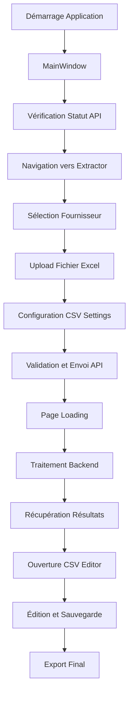

UpdateStatus($"❌ Format invalide : {ex.Message}", "Red");
        MessageBox.Show($"Le fichier CSV contient des erreurs de format :\n\n{ex.Message}\n\nVeuillez vérifier le fichier source.",
                       "Format invalide",
                       MessageBoxButton.OK,
                       MessageBoxImage.Error);
    }
    catch (UnauthorizedAccessException ex)
    {
        UpdateStatus("❌ Accès refusé au fichier", "Red");
        MessageBox.Show("Accès refusé au fichier. Vérifiez les permissions.",
                       "Accès refusé",
                       MessageBoxButton.OK,
                       MessageBoxImage.Error);
        Logger.Log($"UnauthorizedAccessException LoadRemoteCsvAsync: {ex}");
    }
    catch (Exception ex)
    {
        UpdateStatus("❌ Erreur lors du chargement", "Red");
        MessageBox.Show($"Erreur inattendue lors du chargement :\n\n{ex.Message}",
                       "Erreur",
                       MessageBoxButton.OK,
                       MessageBoxImage.Error);
        Logger.Log($"Erreur générale LoadRemoteCsvAsync: {ex}");
    }
}
```

#### 5. Classes d'exceptions personnalisées
```csharp
// Exceptions personnalisées pour une meilleure gestion d'erreurs
public class ApiException : Exception
{
    public int StatusCode { get; }
    public string ResponseContent { get; }

    public ApiException(string message, int statusCode, string responseContent = null) 
        : base(message)
    {
        StatusCode = statusCode;
        ResponseContent = responseContent;
    }
}

public class ValidationException : Exception
{
    public List<string> ValidationErrors { get; }

    public ValidationException(string message, List<string> validationErrors = null) 
        : base(message)
    {
        ValidationErrors = validationErrors ?? new List<string>();
    }
}

public class FileProcessingException : Exception
{
    public string FilePath { get; }

    public FileProcessingException(string message, string filePath, Exception innerException = null) 
        : base(message, innerException)
    {
        FilePath = filePath;
    }
}
```

#### 6. Système de retry automatique
```csharp
public class RetryHelper
{
    public static async Task<T> RetryAsync<T>(
        Func<Task<T>> operation,
        int maxRetries = 3,
        TimeSpan delay = default)
    {
        if (delay == default)
            delay = TimeSpan.FromSeconds(1);

        Exception lastException = null;

        for (int retry = 0; retry <= maxRetries; retry++)
        {
            try
            {
                return await operation();
            }
            catch (Exception ex) when (retry < maxRetries)
            {
                lastException = ex;
                Logger.Log($"Tentative {retry + 1} échouée : {ex.Message}. Retry dans {delay.TotalSeconds}s...");
                await Task.Delay(delay);
                delay = TimeSpan.FromMilliseconds(delay.TotalMilliseconds * 1.5); // Backoff exponentiel
            }
        }

        throw lastException ?? new Exception("Toutes les tentatives ont échoué");
    }
}

// Utilisation dans ApiService
public async Task<string> UploadFileWithRetryAsync(string filePath, string supplierCode)
{
    return await RetryHelper.RetryAsync(async () =>
    {
        return await UploadFileAsync(filePath, supplierCode);
    }, maxRetries: 3, delay: TimeSpan.FromSeconds(2));
}
```

---

## 🔧 Configuration et déploiement

### 1. Configuration de l'application

#### App.config
```xml
<?xml version="1.0" encoding="utf-8"?>
<configuration>
    <startup>
        <supportedRuntime version="v4.0" sku=".NETFramework,Version=v4.8" />
    </startup>
    
    <appSettings>
        <!-- Configuration API -->
        <add key="ApiBaseUrl" value="http://192.168.1.2:8890/api/" />
        <add key="ApiTimeout" value="300" />
        <add key="MaxRetries" value="3" />
        
        <!-- Configuration de l'application -->
        <add key="LogLevel" value="Debug" />
        <add key="AutoSaveInterval" value="30" />
        <add key="MaxFileSize" value="52428800" /> <!-- 50MB -->
        
        <!-- Configuration UI -->
        <add key="Theme" value="Dark" />
        <add key="Language" value="fr-FR" />
    </appSettings>
    
    <connectionStrings>
        <!-- Si une base locale est ajoutée plus tard -->
        <add name="LocalDatabase" connectionString="Data Source=plmanager.db;" providerName="System.Data.SQLite" />
    </connectionStrings>
</configuration>
```

#### Configuration dynamique dans ApiService
```csharp
public class ApiService
{
    private readonly string _baseApiUrl;
    private readonly int _apiTimeout;
    private readonly int _maxRetries;

    public ApiService()
    {
        // Lecture de la configuration
        _baseApiUrl = ConfigurationManager.AppSettings["ApiBaseUrl"] 
                     ?? "http://localhost:8000/api/";
        
        _apiTimeout = int.Parse(ConfigurationManager.AppSettings["ApiTimeout"] ?? "300");
        _maxRetries = int.Parse(ConfigurationManager.AppSettings["MaxRetries"] ?? "3");

        // Configuration HttpClient
        _httpClient = new HttpClient
        {
            Timeout = TimeSpan.FromSeconds(_apiTimeout)
        };
    }
}
```

### 2. Système de déploiement ClickOnce

#### PLManager.csproj - Configuration ClickOnce
```xml
<PropertyGroup>
    <!-- Configuration ClickOnce -->
    <IsWebBootstrapper>false</IsWebBootstrapper>
    <PublishUrl>\\SRV-AZ-FICHIERS\Dossiers Communs\INFORMATIQUE TELECOM\Informatique\PLManager\</PublishUrl>
    <Install>true</Install>
    <InstallFrom>Unc</InstallFrom>
    <UpdateEnabled>true</UpdateEnabled>
    <UpdateMode>Foreground</UpdateMode>
    <UpdateInterval>7</UpdateInterval>
    <UpdateIntervalUnits>Days</UpdateIntervalUnits>
    <UpdatePeriodically>false</UpdatePeriodically>
    <UpdateRequired>false</UpdateRequired>
    <MapFileExtensions>true</MapFileExtensions>
    <CreateWebPageOnPublish>true</CreateWebPageOnPublish>
    <WebPage>publish.htm</WebPage>
    <ApplicationRevision>1</ApplicationRevision>
    <ApplicationVersion>1.0.0.*</ApplicationVersion>
    <UseApplicationTrust>false</UseApplicationTrust>
    <PublishWizardCompleted>true</PublishWizardCompleted>
    <BootstrapperEnabled>true</BootstrapperEnabled>
</PropertyGroup>

<!-- Signature des assemblies -->
<PropertyGroup>
    <SignManifests>true</SignManifests>
    <ManifestCertificateThumbprint>4690EC5FEFF2172BF35E5ED9D1EB7456F2607E26</ManifestCertificateThumbprint>
    <SignAssembly>true</SignAssembly>
    <AssemblyOriginatorKeyFile>PLManager_TemporaryKey.pfx</AssemblyOriginatorKeyFile>
</PropertyGroup>
```

#### Script de déploiement automatique
```powershell
# deploy.ps1 - Script de déploiement
param(
    [string]$Environment = "Prod",
    [string]$Version = "1.0.0"
)

Write-Host "🚀 Déploiement PLManager $Version - $Environment" -ForegroundColor Green

# 1. Build de l'application
Write-Host "📦 Build de l'application..." -ForegroundColor Yellow
msbuild PLManager.sln /p:Configuration=Release /p:Platform="Any CPU"

if ($LASTEXITCODE -ne 0) {
    Write-Host "❌ Échec du build" -ForegroundColor Red
    exit 1
}

# 2. Publication ClickOnce
Write-Host "📤 Publication ClickOnce..." -ForegroundColor Yellow
msbuild PLManager.csproj /target:Publish /p:Configuration=Release /p:ApplicationVersion=$Version

if ($LASTEXITCODE -ne 0) {
    Write-Host "❌ Échec de la publication" -ForegroundColor Red
    exit 1
}

# 3. Copie des fichiers de configuration
Write-Host "⚙️ Copie de la configuration..." -ForegroundColor Yellow
$publishPath = "bin\Release\app.publish"
$configPath = "Config\$Environment"

if (Test-Path $configPath) {
    Copy-Item "$configPath\*" "$publishPath\" -Recurse -Force
}

# 4. Notification de fin
Write-Host "✅ Déploiement terminé avec succès !" -ForegroundColor Green
Write-Host "📍 Emplacement : $publishPath" -ForegroundColor Cyan
```

### 3. Gestion des mises à jour

#### Vérification automatique des mises à jour
```csharp
public class UpdateManager
{
    private readonly ApplicationDeployment _deployment;

    public UpdateManager()
    {
        if (ApplicationDeployment.IsNetworkDeployed)
        {
            _deployment = ApplicationDeployment.CurrentDeployment;
        }
    }

    public async Task<bool> CheckForUpdatesAsync()
    {
        if (_deployment == null) return false;

        try
        {
            UpdateCheckInfo info = await Task.Run(() => _deployment.CheckForUpdate());
            
            if (info.UpdateAvailable)
            {
                var result = MessageBox.Show(
                    $"Une nouvelle version ({info.AvailableVersion}) est disponible.\n\nVoulez-vous installer la mise à jour maintenant ?",
                    "Mise à jour disponible",
                    MessageBoxButton.YesNo,
                    MessageBoxImage.Information);

                if (result == MessageBoxResult.Yes)
                {
                    return await InstallUpdateAsync();
                }
            }
            else
            {
                Logger.Log("Aucune mise à jour disponible");
            }
        }
        catch (Exception ex)
        {
            Logger.Log($"Erreur vérification mise à jour : {ex.Message}");
        }

        return false;
    }

    private async Task<bool> InstallUpdateAsync()
    {
        try
        {
            await Task.Run(() => _deployment.Update());
            
            MessageBox.Show(
                "Mise à jour installée avec succès.\n\nL'application va redémarrer.",
                "Mise à jour terminée",
                MessageBoxButton.OK,
                MessageBoxImage.Information);

            Application.Current.Shutdown();
            System.Windows.Forms.Application.Restart();
            return true;
        }
        catch (Exception ex)
        {
            MessageBox.Show(
                $"Erreur lors de l'installation de la mise à jour :\n\n{ex.Message}",
                "Erreur de mise à jour",
                MessageBoxButton.OK,
                MessageBoxImage.Error);
            
            Logger.Log($"Erreur installation mise à jour : {ex}");
            return false;
        }
    }
}

// Utilisation dans MainWindow
private async void CheckForUpdates()
{
    var updateManager = new UpdateManager();
    await updateManager.CheckForUpdatesAsync();
}
```

### 4. Logging et diagnostics

#### Configuration avancée du Logger
```csharp
public static class Logger
{
    private static readonly string LogDirectory = Path.Combine(
        Environment.GetFolderPath(Environment.SpecialFolder.ApplicationData),
        "PLManager",
        "Logs"
    );
    
    private static readonly string LogFilePath = Path.Combine(
        LogDirectory,
        $"PLManager_{DateTime.Now:yyyy-MM-dd}.log"
    );

    private static readonly object _lockObject = new object();

    static Logger()
    {
        Directory.CreateDirectory(LogDirectory);
        
        // Nettoyage des anciens logs (garde 30 jours)
        CleanupOldLogs();
    }

    public static void Log(string message, LogLevel level = LogLevel.Info)
    {
        try
        {
            lock (_lockObject)
            {
                var logEntry = $"{DateTime.Now:yyyy-MM-dd HH:mm:ss.fff} [{level}] {message}";
                
                using (var writer = new StreamWriter(LogFilePath, true, Encoding.UTF8))
                {
                    writer.WriteLine(logEntry);
                }

                // Log aussi dans la console en mode DEBUG
                #if DEBUG
                Console.WriteLine(logEntry);
                #endif
            }
        }
        catch
        {
            // Éviter les boucles infinies si le logging échoue
        }
    }

    public static void LogException(Exception ex, string context = "")
    {
        var message = string.IsNullOrEmpty(context) 
            ? $"Exception: {ex}" 
            : $"Exception dans {context}: {ex}";
        
        Log(message, LogLevel.Error);
    }

    private static void CleanupOldLogs()
    {
        try
        {
            var files = Directory.GetFiles(LogDirectory, "PLManager_*.log");
            var cutoffDate = DateTime.Now.AddDays(-30);

            foreach (var file in files)
            {
                var fileInfo = new FileInfo(file);
                if (fileInfo.CreationTime < cutoffDate)
                {
                    fileInfo.Delete();
                }
            }
        }
        catch
        {
            // Ignore les erreurs de nettoyage
        }
    }
}

public enum LogLevel
{
    Debug,
    Info,
    Warning,
    Error,
    Critical
}
```

### 5. Tests et validation

#### Tests d'intégration automatisés
```csharp
[TestClass]
public class IntegrationTests
{
    private ApiService _apiService;
    private PackingListViewModel _viewModel;

    [TestInitialize]
    public void Setup()
    {
        _apiService = new ApiService();
        _viewModel = new PackingListViewModel();
    }

    [TestMethod]
    public async Task TestCompleteWorkflow()
    {
        // Arrange
        var testFile = CreateTestExcelFile();
        var testSupplier = new SupplierModel { Code = "TEST", Name = "Test Supplier" };
        
        AppState.Instance.SetSelectedFile(testFile);
        AppState.Instance.SetSelectedSupplier(testSupplier);

        // Act
        var result = await _viewModel.ValidateAndExtractAsync();

        // Assert
        Assert.IsTrue(result, "Le workflow complet devrait réussir");
        Assert.IsNotNull(AppState.Instance.ExtractionId, "Un ID d'extraction devrait être généré");
        Assert.IsTrue(AppState.Instance.ExtractedFiles?.Count > 0, "Des fichiers devraient être générés");
    }

    [TestMethod]
    public async Task TestApiConnectivity()
    {
        // Test de connectivité API
        var isConnected = await _apiService.CheckApiStatus();
        Assert.IsTrue(isConnected, "L'API devrait être accessible");
    }

    [TestMethod]
    public void TestCsvEditorFunctionality()
    {
        // Test des fonctionnalités de l'éditeur CSV
        var editor = new CSVEditorWindow();
        // Tests des fonctions d'édition, sauvegarde, etc.
    }

    private string CreateTestExcelFile()
    {
        // Création d'un fichier Excel de test
        // ...
        return "test_file.xlsx";
    }
}
```

---

## 🎯 Bonnes pratiques et recommandations

### 1. Architecture et code

#### Principes SOLID appliqués
- **SRP** : Chaque classe a une responsabilité unique (ApiService, AppState, etc.)
- **OCP** : Extensions possibles sans modification (nouveaux fournisseurs)
- **DIP** : Dépendance sur abstractions (interfaces pour les services)

#### Pattern MVVM renforcé
```csharp
// Interface pour les ViewModels
public interface IViewModel : INotifyPropertyChanged
{
    bool IsLoading { get; set; }
    string StatusMessage { get; set; }
    void Reset();
}

// Classe de base pour les ViewModels
public abstract class ViewModelBase : IViewModel
{
    private bool _isLoading;
    private string _statusMessage;

    public bool IsLoading
    {
        get => _isLoading;
        set { _isLoading = value; OnPropertyChanged(); }
    }

    public string StatusMessage
    {
        get => _statusMessage;
        set { _statusMessage = value; OnPropertyChanged(); }
    }

    public abstract void Reset();

    public event PropertyChangedEventHandler PropertyChanged;

    protected virtual void OnPropertyChanged([CallerMemberName] string propertyName = null)
    {
        PropertyChanged?.Invoke(this, new PropertyChangedEventArgs(propertyName));
    }

    protected bool SetProperty<T>(ref T storage, T value, [CallerMemberName] string propertyName = null)
    {
        if (EqualityComparer<T>.Default.Equals(storage, value))
            return false;

        storage = value;
        OnPropertyChanged(propertyName);
        return true;
    }
}
```

### 2. Performance et optimisation

#### Chargement asynchrone des pages
```csharp
public class LazyPageLoader
{
    private readonly Dictionary<Type, Lazy<Page>> _pageCache = new();

    public T GetPage<T>() where T : Page, new()
    {
        var pageType = typeof(T);
        
        if (!_pageCache.ContainsKey(pageType))
        {
            _pageCache[pageType] = new Lazy<Page>(() => new T());
        }

        return (T)_pageCache[pageType].Value;
    }

    public void PreloadPages()
    {
        // Préchargement en arrière-plan
        Task.Run(() =>
        {
            GetPage<Home>();
            GetPage<CSVSettingsPage>();
            GetPage<LoadingPage>();
        });
    }
}
```

#### Optimisation des bindings
```csharp
// Utilisation de OneWay binding quand possible
<TextBlock Text="{Binding StatusMessage, Mode=OneWay}"/>

// Virtualisation pour les grandes listes
<ListBox VirtualizingPanel.IsVirtualizing="True"
         VirtualizingPanel.VirtualizationMode="Recycling">
    <!-- Items -->
</ListBox>

// Binding avec UpdateSourceTrigger optimisé
<TextBox Text="{Binding SearchText, UpdateSourceTrigger=PropertyChanged, Delay=300}"/>
```

### 3. Sécurité et robustesse

#### Validation des entrées utilisateur
```csharp
public static class InputValidator
{
    public static ValidationResult ValidateFilePath(string filePath)
    {
        if (string.IsNullOrWhiteSpace(filePath))
            return ValidationResult.Error("Le chemin de fichier ne peut pas être vide");

        if (!File.Exists(filePath))
            return ValidationResult.Error("Le fichier spécifié n'existe pas");

        var extension = Path.GetExtension(filePath).ToLower();
        var allowedExtensions = new[] { ".xlsx", ".xls" };
        
        if (!allowedExtensions.Contains(extension))
            return ValidationResult.Error($"Format de fichier non supporté. Extensions autorisées : {string.Join(", ", allowedExtensions)}");

        var fileInfo = new FileInfo(filePath);
        if (fileInfo.Length > 50 * 1024 * 1024) // 50MB
            return ValidationResult.Error("Le fichier est trop volumineux (limite : 50MB)");

        return ValidationResult.Success();
    }

    public static ValidationResult ValidateSupplierCode(string supplierCode)
    {
        if (string.IsNullOrWhiteSpace(supplierCode))
            return ValidationResult.Error("Le code fournisseur est requis");

        if (!Regex.IsMatch(supplierCode, @"^[A-Za-z0-9_-]+$"))
            return ValidationResult.Error("Le code fournisseur contient des caractères invalides");

        return ValidationResult.Success();
    }
}

public class ValidationResult
{
    public bool IsValid { get; private set; }
    public string ErrorMessage { get; private set; }

    private ValidationResult(bool isValid, string errorMessage = null)
    {
        IsValid = isValid;
        ErrorMessage = errorMessage;
    }

    public static ValidationResult Success() => new(true);
    public static ValidationResult Error(string message) => new(false, message);
}
```

#### Sécurisation des communications API
```csharp
public class SecureApiService : ApiService
{
    private readonly string _apiKey;

    public SecureApiService()
    {
        _apiKey = ConfigurationManager.AppSettings["ApiKey"];
        
        // Configuration des headers de sécurité
        _httpClient.DefaultRequestHeaders.Add("X-API-Key", _apiKey);
        _httpClient.DefaultRequestHeaders.Add("User-Agent", "PLManager/1.0.0");
    }

    protected override HttpRequestMessage CreateRequest(HttpMethod method, string endpoint)
    {
        var request = base.CreateRequest(method, endpoint);
        
        // Ajout de timestamp pour éviter les attaques de replay
        request.Headers.Add("X-Timestamp", DateTimeOffset.UtcNow.ToUnixTimeSeconds().ToString());
        
        return request;
    }
}
```

### 4. Extensibilité future

#### Système de plugins
```csharp
public interface ISupplierPlugin
{
    string SupplierCode { get; }
    string SupplierName { get; }
    bool CanProcess(string filePath);
    Task<ProcessingResult> ProcessFileAsync(string filePath, Dictionary<string, object> settings);
}

public class PluginManager
{
    private readonly List<ISupplierPlugin> _plugins = new();

    public void LoadPlugins()
    {
        var pluginDirectory = Path.Combine(AppDomain.CurrentDomain.BaseDirectory, "Plugins");
        
        if (!Directory.Exists(pluginDirectory))
            return;

        var pluginFiles = Directory.GetFiles(pluginDirectory, "*.dll");
        
        foreach (var file in pluginFiles)
        {
            try
            {
                var assembly = Assembly.LoadFrom(file);
                var pluginTypes = assembly.GetTypes()
                    .Where(t => typeof(ISupplierPlugin).IsAssignableFrom(t) && !t.IsInterface && !t.IsAbstract);

                foreach (var type in pluginTypes)
                {
                    var plugin = (ISupplierPlugin)Activator.CreateInstance(type);
                    _plugins.Add(plugin);
                    Logger.Log($"Plugin chargé : {plugin.SupplierName}");
                }
            }
            catch (Exception ex)
            {
                Logger.LogException(ex, $"Chargement plugin {file}");
            }
        }
    }

    public ISupplierPlugin FindPluginForFile(string filePath)
    {
        return _plugins.FirstOrDefault(p => p.CanProcess(filePath));
    }
}
```

#### Configuration externalisée
```csharp
public class ConfigurationManager
{
    private readonly Dictionary<string, object> _settings = new();
    private readonly string _configFile;

    public ConfigurationManager()
    {
        _configFile = Path.Combine(
            Environment.GetFolderPath(Environment.SpecialFolder.ApplicationData),
            "PLManager",
            "config.json"
        );
        
        LoadConfiguration();
    }

    public T GetSetting<T>(string key, T defaultValue = default)
    {
        if (_settings.TryGetValue(key, out var value))
        {
            try
            {
                return (T)Convert.ChangeType(value, typeof(T));
            }
            catch
            {
                return defaultValue;
            }
        }
        
        return defaultValue;
    }

    public void SetSetting<T>(string key, T value)
    {
        _settings[key] = value;
        SaveConfiguration();
    }

    private void LoadConfiguration()
    {
        try
        {
            if (File.Exists(_configFile))
            {
                var json = File.ReadAllText(_configFile);
                var settings = JsonConvert.DeserializeObject<Dictionary<string, object>>(json);
                
                foreach (var kvp in settings)
                {
                    _settings[kvp.Key] = kvp.Value;
                }
            }
        }
        catch (Exception ex)
        {
            Logger.LogException(ex, "Chargement configuration");
        }
    }

    private void SaveConfiguration()
    {
        try
        {
            Directory.CreateDirectory(Path.GetDirectoryName(_configFile));
            var json = JsonConvert.SerializeObject(_settings, Formatting.Indented);
            File.WriteAllText(_configFile, json);
        }
        catch (Exception ex)
        {
            Logger.LogException(ex, "Sauvegarde configuration");
        }
    }
}
```

---

## 🔮 Perspectives d'évolution

### 1. Améliorations techniques prioritaires

#### Migration vers .NET 6/8
```csharp
// Avantages de la migration :
// - Performances améliorées
// - Support long terme
// - Nouvelles fonctionnalités C#
// - Meilleure compatibilité multiplateforme

// Changements nécessaires :
// - Mise à jour des packages NuGet
// - Adaptation du système de déploiement
// - Tests de compatibilité
```

#### Implémentation d'une base de données locale
```sql
-- Schema SQLite pour l'historique local
CREATE TABLE ExtractionHistory (
    Id INTEGER PRIMARY KEY AUTOINCREMENT,
    ExtractionId TEXT NOT NULL,
    SupplierCode TEXT NOT NULL,
    OriginalFileName TEXT NOT NULL,
    ProcessedDate DATETIME NOT NULL,
    Status TEXT NOT NULL,
    GeneratedFiles TEXT, -- JSON array
    ErrorMessage TEXT,
    ProcessingTimeSeconds INTEGER
);

CREATE TABLE UserSettings (
    Key TEXT PRIMARY KEY,
    Value TEXT NOT NULL,
    LastModified DATETIME NOT NULL
);

CREATE TABLE RecentFiles (
    Id INTEGER PRIMARY KEY AUTOINCREMENT,
    FilePath TEXT NOT NULL,
    SupplierCode TEXT NOT NULL,
    LastAccess DATETIME NOT NULL,
    FileSize INTEGER
);
```

#### Architecture modulaire avancée
```csharp
// Système de modules avec injection de dépendances
public interface IModule
{
    string Name { get; }
    string Version { get; }
    bool IsEnabled { get; set; }
    Task InitializeAsync();
    Task ShutdownAsync();
}

public class ModuleManager
{
    private readonly List<IModule> _modules = new();
    private readonly IServiceProvider _serviceProvider;

    public async Task LoadModulesAsync()
    {
        // Découverte automatique des modules
        // Injection des dépendances
        // Initialisation ordonnée
    }
}
```

### 2. Fonctionnalités utilisateur avancées

#### Dashboard avancé avec métriques
```csharp
public class DashboardViewModel : ViewModelBase
{
    public ObservableCollection<ExtractionMetric> RecentExtractions { get; }
    public ObservableCollection<SupplierStatistic> SupplierStats { get; }
    public ChartData ProcessingTimeChart { get; }
    public ChartData ErrorRateChart { get; }

    // Métriques en temps réel
    public int TotalExtractionsToday { get; set; }
    public int SuccessRate { get; set; }
    public TimeSpan AverageProcessingTime { get; set; }
}
```

#### Système de notifications
```csharp
public class NotificationService
{
    public void ShowToast(string message, NotificationType type)
    {
        // Notifications Windows 10/11
        // Intégration avec le système de notifications
    }

    public void ShowInAppNotification(string message, TimeSpan duration)
    {
        // Notifications dans l'application
        // Animation et auto-dismiss
    }
}
```

#### Éditeur CSV avancé avec formules
```csharp
public class AdvancedCsvEditor
{
    // Fonctionnalités avancées :
    // - Formules Excel-like
    // - Validation en temps réel
    // - Historique détaillé des modifications
    // - Comparaison de versions
    // - Export vers Excel avec formatage
}
```

### 3. Architecture distribuée

#### Client-serveur avec SignalR
```csharp
// Hub SignalR pour communication temps réel
public class ProcessingHub : Hub
{
    public async Task JoinGroup(string extractionId)
    {
        await Groups.AddToGroupAsync(Context.ConnectionId, extractionId);
    }

    public async Task NotifyProgress(string extractionId, int progress, string message)
    {
        await Clients.Group(extractionId).SendAsync("ProgressUpdate", progress, message);
    }
}

// Client WPF avec SignalR
public class RealtimeProgressService
{
    private HubConnection _connection;

    public async Task ConnectAsync()
    {
        _connection = new HubConnectionBuilder()
            .WithUrl("https://api.plmanager.com/processingHub")
            .Build();

        _connection.On<int, string>("ProgressUpdate", OnProgressUpdate);
        await _connection.StartAsync();
    }

    private void OnProgressUpdate(int progress, string message)
    {
        Application.Current.Dispatcher.Invoke(() =>
        {
            // Mise à jour de l'UI en temps réel
        });
    }
}
```

---

## 📝 Conclusion

PLManager Frontend constitue une **application WPF moderne et robuste** qui s'intègre parfaitement avec le backend Python FastAPI. Son architecture MVVM bien structurée, ses services modulaires et sa gestion d'erreurs complète en font une solution fiable pour le traitement des Packing Lists.

### Points forts de l'architecture

1. **Séparation claire des responsabilités** avec le pattern MVVM
2. **Communication API robuste** avec retry et gestion d'erreurs
3. **Interface utilisateur moderne** avec thèmes et navigation fluide
4. **Système de logging complet** pour le debugging et le monitoring
5. **Déploiement automatisé** avec ClickOnce et mises à jour automatiques

### Recommandations pour le développeur

1. **Comprendre le workflow complet** : Suivre le flux depuis l'upload jusqu'à l'édition CSV
2. **Maîtriser les services** : ApiService et AppState sont les composants centraux
3. **Étendre prudemment** : Utiliser les patterns existants pour ajouter de nouvelles fonctionnalités
4. **Tester rigoureusement** : Chaque# 🖥️ PLManager Frontend - Documentation Technique Complète

**Version:** 1.0.0  
**Framework:** WPF (.NET Framework 4.8)  
**Architecture:** MVVM Pattern  
**Backend:** PLManager API (Python FastAPI)  
**Langage:** C#

---

## 📋 Table des matières

- [Vue d'ensemble](#vue-densemble)
- [Architecture générale](#architecture-générale)
- [Installation et démarrage](#installation-et-démarrage)
- [Structure du projet](#structure-du-projet)
- [Application principale](#application-principale)
- [Pages et navigation](#pages-et-navigation)
- [Services](#services)
- [ViewModels](#viewmodels)
- [Modèles de données](#modèles-de-données)
- [Helpers et utilitaires](#helpers-et-utilitaires)
- [Contrôles personnalisés](#contrôles-personnalisés)
- [Workflow complet](#workflow-complet)
- [Gestion des erreurs](#gestion-des-erreurs)
- [Configuration et déploiement](#configuration-et-déploiement)

---

## 🎯 Vue d'ensemble

PLManager Frontend est une application **WPF desktop** développée en **C# .NET Framework 4.8** qui constitue l'interface utilisateur du système PLManager. Cette application permet aux utilisateurs de traiter les Packing Lists Excel des fournisseurs et de les convertir en CSV normalisés via une interface moderne et intuitive.

### 🎭 Fonctionnalités principales
- **Interface de navigation moderne** avec menu latéral
- **Upload et traitement** de fichiers Excel fournisseurs
- **Configuration des paramètres CSV** (pays, transitaire, importateur)
- **Éditeur CSV avancé** avec grille éditable
- **Système de chargement** avec indicateurs de progression
- **Gestion multi-fichiers** pour les extractions multiples
- **Communication API** temps réel avec le backend Python

### 🏢 Architecture technique
- **Pattern MVVM** pour la séparation des préoccupations
- **Navigation par pages** avec Frame et UserControls
- **Communication API HTTP** avec HttpClient
- **Gestion d'état globale** avec singleton AppState
- **Thèmes et styles** centralisés avec ResourceDictionary

---

## 🏗️ Architecture générale

### Structure MVVM
```
View (XAML) ↔ ViewModel (C#) ↔ Model (C#) ↔ Service (C#) ↔ API (Python)
    ↓              ↓              ↓           ↓           ↓
MainWindow     PackingListVM   PackingList  ApiService  FastAPI
Pages/         SelectSuppVM    Supplier     AppState    Backend
Controls/      CellEditModel   FileUpload   Logger
```

### Technologies utilisées
- **WPF** - Interface utilisateur Windows Presentation Foundation
- **MVVM Pattern** - Architecture Model-View-ViewModel
- **HttpClient** - Communication HTTP avec l'API backend
- **CsvHelper** - Manipulation des fichiers CSV
- **SourceGrid** - Grille éditable pour l'éditeur CSV
- **Newtonsoft.Json** - Sérialisation/désérialisation JSON
- **AvalonEdit** - Éditeur de texte avancé
- **MahApps.Metro** - UI moderne et thèmes

---

## 🚀 Installation et démarrage

### Prérequis
- **.NET Framework 4.8** ou supérieur
- **Visual Studio 2019+** ou **Visual Studio Code**
- **Backend PLManager** (Python FastAPI) en fonctionnement

### Installation
```bash
# Cloner le projet
git clone <repository-url>
cd PLManager_frontend

# Ouvrir avec Visual Studio
start PLManager.sln

# Ou avec VS Code
code .
```

### Configuration
1. **Backend API** : Vérifier l'URL dans `Services/ApiService.cs`
```csharp
public string BaseApiUrl { get; } = "http://192.168.1.2:8890/api/";
```

2. **Dépendances NuGet** : Restaurer les packages
```xml
<PackageReference Include="CsvHelper" Version="33.0.1" />
<PackageReference Include="Newtonsoft.Json" Version="13.0.3" />
<PackageReference Include="AvalonEdit" Version="6.3.1.120" />
<PackageReference Include="MahApps.Metro" Version="2.4.10" />
```

3. **Compilation** : Build en mode Debug ou Release
```bash
# Via Visual Studio
Build > Build Solution

# Via CLI
msbuild PLManager.sln /p:Configuration=Release
```

### Déploiement
L'application utilise **ClickOnce** pour le déploiement automatisé :
```xml
<PublishUrl>\\SRV-AZ-FICHIERS\Dossiers Communs\INFORMATIQUE TELECOM\Informatique\PLManager\</PublishUrl>
<UpdateEnabled>true</UpdateEnabled>
<UpdateMode>Foreground</UpdateMode>
<UpdateInterval>7</UpdateInterval>
```

---

## 📁 Structure du projet

```
PLManager/
│
├── App.xaml / App.xaml.cs              # Application principale et ressources
├── MainWindow.xaml / MainWindow.xaml.cs # Fenêtre principale et navigation
│
├── Pages/                               # Pages de l'application
│   ├── Home.xaml/.cs                   # Tableau de bord
│   ├── SelectSupplier.xaml/.cs         # Sélection fournisseur
│   ├── CSVSettingsPage.xaml/.cs        # Configuration CSV
│   ├── Extractor.xaml/.cs              # Page d'extraction
│   ├── LoadingPage.xaml/.cs            # Page de chargement
│   ├── CSVEditor.xaml/.cs              # Éditeur CSV (Page)
│   ├── CSVEditorWindow.xaml/.cs        # Éditeur CSV (Window)
│   └── EditorWindow.xaml/.cs           # Éditeur local
│
├── Services/                            # Services métier
│   ├── ApiService.cs                   # Communication API principale
│   ├── ApiClientService.cs             # Client API spécialisé
│   ├── FileUploadService.cs            # Upload de fichiers
│   └── AppState.cs                     # État global de l'application
│
├── ViewModels/                          # ViewModels MVVM
│   ├── PackingListViewModel.cs         # ViewModel principal
│   └── SelectSupplierViewModel.cs      # ViewModel sélection fournisseur
│
├── Model/                               # Modèles de données
│   ├── PackingListModel.cs             # Modèle Packing List
│   ├── SupplierModel.cs                # Modèle Fournisseur
│   └── CellEditModel.cs                # Modèle édition cellule
│
├── Helpers/                             # Utilitaires et convertisseurs
│   ├── RelayCommand.cs                 # Commande MVVM
│   ├── RelayCommandT.cs                # Commande MVVM générique
│   ├── Logger.cs                       # Système de logs
│   ├── BoolToVisibilityConverter.cs    # Convertisseur booléen/visibilité
│   ├── InvertedBoolToVisibilityConverter.cs
│   └── EmptyTextToVisibilityConverter.cs
│
├── Controls/                            # Contrôles personnalisés
│   ├── MenuItem.xaml/.cs               # Élément de menu
│   ├── UserPopup.xaml/.cs              # Popup utilisateur
│   └── DashedBorder.cs                 # Bordure en pointillés
│
├── Assets/                              # Ressources visuelles
│   └── Icons.xaml                      # Dictionnaire d'icônes
│
├── Styles/                              # Styles et thèmes
│   └── MainStyle.xaml                  # Styles principaux
│
├── Themes/                              # Thèmes d'application
│   └── DarkTheme.xaml                  # Thème sombre
│
└── Resources/                           # Ressources (images, etc.)
    └── logoblanc.png                   # Logo de l'application
```

---

## 🪟 Application principale

### App.xaml / App.xaml.cs
**Responsabilité :** Point d'entrée de l'application et configuration des ressources globales

#### App.xaml - Configuration des ressources
```xml
<Application x:Class="WPFModernVerticalMenu.App"
             StartupUri="MainWindow.xaml">
    <Application.Resources>
        <ResourceDictionary>
            <ResourceDictionary.MergedDictionaries>
                <ResourceDictionary Source="Themes/DarkTheme.xaml"/>
                <ResourceDictionary Source="Assets/Icons.xaml"/>
                <ResourceDictionary Source="Styles/MainStyle.xaml"/>
            </ResourceDictionary.MergedDictionaries>

            <!-- Convertisseurs pour la visibilité -->
            <helpers:BoolToVisibilityConverter x:Key="BoolToVisibilityConverter"/>
            <helpers:InvertedBoolToVisibilityConverter x:Key="InvertedBoolToVisibilityConverter"/>
        </ResourceDictionary>
    </Application.Resources>
</Application>
```

**Fonctionnalités :**
- **Chargement des thèmes** (DarkTheme.xaml)
- **Dictionnaire d'icônes** centralisé
- **Styles globaux** de l'application
- **Convertisseurs** de types pour le binding

### MainWindow.xaml / MainWindow.xaml.cs
**Responsabilité :** Fenêtre principale avec navigation et menu latéral

#### Structure UI de MainWindow
```xml
<Window Title="PLManager - Principal" 
        Height="650" Width="1000"
        WindowStyle="None" 
        AllowsTransparency="True"
        Background="Transparent">
    
    <Border CornerRadius="8">
        <Grid>
            <!-- Colonne 1: Menu de navigation -->
            <Border Background="{DynamicResource SecundaryBackgroundColor}">
                <Grid x:Name="GridNav" Width="60">
                    <!-- Logo -->
                    <!-- Boutons de navigation -->
                    <StackPanel>
                        <Button x:Name="btnHome" Click="btnHome_Click">
                            <MenuItem Text="Tableau de bord"/>
                        </Button>
                        <Button x:Name="btnDashboard" Click="btnDashboard_Click">
                            <MenuItem Text="Extraction PL"/>
                        </Button>
                        <Button x:Name="btnLocalEditor" Click="btnLocalEditor_Click">
                            <MenuItem Text="Éditeur local"/>
                        </Button>
                    </StackPanel>
                </Grid>
            </Border>
            
            <!-- Colonne 2: Contenu principal -->
            <Frame x:Name="fContainer" NavigationUIVisibility="Hidden"/>
        </Grid>
    </Border>
</Window>
```

#### MainWindow.xaml.cs - Implémentation
```csharp
public partial class MainWindow : Window, INotifyPropertyChanged
{
    private readonly ApiService _apiService;
    private string _apiStatusText = "API NOT OK";
    private SolidColorBrush _apiStatusColor = new SolidColorBrush(Colors.Red);

    public string ApiStatusText { get; set; }
    public SolidColorBrush ApiStatusColor { get; set; }

    public MainWindow()
    {
        InitializeComponent();
        DataContext = this;

        _apiService = new ApiService();
        _apiService.ApiStatusChanged += UpdateApiStatus;
    }

    // Navigation entre les pages
    private void btnHome_Click(object sender, RoutedEventArgs e)
    {
        fContainer.Navigate(new Uri("Pages/Home.xaml", UriKind.RelativeOrAbsolute));
    }

    public void btnDashboard_Click(object sender, RoutedEventArgs e)
    {
        fContainer.Navigate(new Uri("Pages/Extractor.xaml", UriKind.RelativeOrAbsolute));
    }

    private void btnLocalEditor_Click(object sender, RoutedEventArgs e)
    {
        var win = new EditorWindow();
        win.Show();
    }
}
```

**Fonctionnalités clés :**
- **Fenêtre sans bordure** avec transparence
- **Menu de navigation latéral** avec icônes
- **Navigation par Frame** entre les pages
- **Statut API en temps réel** avec indicateur coloré
- **Gestion des événements** de navigation
- **Pattern INotifyPropertyChanged** pour le binding

---

## 📄 Pages et navigation

### 1. Home.xaml / Home.xaml.cs
**Responsabilité :** Page d'accueil / tableau de bord

#### Home.xaml
```xml
<Page Title="Home">
    <Border CornerRadius="5" Background="{DynamicResource SecundaryBackgroundColor}">
        <TextBlock Text="Tableau de bord" 
                   FontSize="30" 
                   Foreground="{DynamicResource PrimaryTextColor}" 
                   FontWeight="Bold"
                   VerticalAlignment="Center" 
                   HorizontalAlignment="Center"/>
    </Border>
</Page>
```

#### Home.xaml.cs
```csharp
public partial class Home : Page
{
    public Home()
    {
        InitializeComponent();
    }
}
```

**Note :** Page basique servant de tableau de bord, facilement extensible pour ajouter des statistiques.

### 2. SelectSupplier.xaml / SelectSupplier.xaml.cs
**Responsabilité :** Sélection du fournisseur et upload de fichier

#### Fonctionnalités principales
- **Liste des fournisseurs** disponibles
- **Drag & Drop** pour les fichiers Excel
- **Validation** des formats de fichiers
- **Navigation** vers la page de configuration CSV

### 3. CSVSettingsPage.xaml / CSVSettingsPage.xaml.cs
**Responsabilité :** Configuration des paramètres CSV avant traitement

#### CSVSettingsPage.xaml.cs - Implémentation
```csharp
public partial class CSVSettingsPage : Page
{
    private readonly PackingListViewModel _viewModel;

    // Listes pour les ComboBox
    public List<string> CountryList { get; set; }
    public List<string> ForwarderList { get; set; }
    public List<string> ImporterList { get; set; }
    public List<string> ArchiveList { get; set; }

    public CSVSettingsPage()
    {
        InitializeComponent();
        _viewModel = new PackingListViewModel();
        DataContext = this;

        // Initialisation des listes
        CountryList = new List<string> { 
            "ZA", "BR", "MA", "PE", "EG", "US", "IN", "ZW", "KE", "UY", "CO" 
        };
        ForwarderList = new List<string> { 
            "COOL CONTROL", "VDH", "LBP", "SEALOGIS", "GATE 4 EU", "PRIMEVER"
        };
        // ... autres listes
    }
}
```

**Fonctionnalités :**
- **ComboBox dynamiques** avec listes prédéfinies
- **Validation des champs** obligatoires
- **Sauvegarde des paramètres** avant traitement
- **Interface utilisateur** claire et intuitive

### 4. Extractor.xaml / Extractor.xaml.cs
**Responsabilité :** Page principale d'extraction avec workflow complet

**Fonctionnalités :**
- **Affichage du fichier** sélectionné
- **Configuration** des paramètres CSV
- **Lancement** du traitement
- **Affichage des résultats** d'extraction

### 5. LoadingPage.xaml / LoadingPage.xaml.cs
**Responsabilité :** Page de chargement avec indicateur de progression

**Fonctionnalités :**
- **Indicateur de progression** animé
- **Messages d'état** du traitement
- **Gestion des timeouts** et erreurs

### 6. CSVEditor.xaml/.cs et CSVEditorWindow.xaml/.cs
**Responsabilité :** Éditeur CSV avancé avec grille éditable

#### CSVEditorWindow.xaml.cs - Implémentation détaillée
```csharp
public partial class CSVEditorWindow : Window
{
    private DataTable csvData;
    private Grid sourceGrid;
    private string CurrentFilePath;
    private bool IsFromApi = false;
    private string OriginalApiPath = null;
    private List<string> allExtractedFiles = new List<string>();
    private int currentFileIndex = 0;
    private readonly ApiClientService _apiClientService = new ApiClientService();
    private Stack<List<CellEditModel>> undoStack = new Stack<List<CellEditModel>>();

    public CSVEditorWindow()
    {
        InitializeComponent();
        InitializeSourceGrid();
        this.KeyDown += CSVEditorWindow_KeyDown;
    }

    public CSVEditorWindow(string csvPath) : this()
    {
        OriginalApiPath = csvPath;
        _ = LoadRemoteCsvAsync(csvPath);
        if (AppState.Instance.ExtractedFiles != null && AppState.Instance.ExtractedFiles.Count > 0)
        {
            _ = LoadCsvFiles(AppState.Instance.ExtractedFiles);
        }
    }

    private void InitializeSourceGrid()
    {
        sourceGrid = new Grid
        {
            Dock = System.Windows.Forms.DockStyle.Fill,
            BorderStyle = System.Windows.Forms.BorderStyle.FixedSingle
        };
        GridHost.Child = sourceGrid; 
    }
}
```

**Fonctionnalités avancées :**
- **Grille éditable** avec SourceGrid
- **Undo/Redo** avec stack de modifications
- **Import/Export CSV** avec CsvHelper
- **Navigation multi-fichiers** pour les extractions multiples
- **Sauvegarde automatique** des modifications
- **Validation** des données en temps réel

### 7. EditorWindow.xaml / EditorWindow.xaml.cs
**Responsabilité :** Éditeur local pour fichiers CSV locaux

**Différences avec CSVEditorWindow :**
- **Mode hors ligne** sans API
- **Ouverture de fichiers locaux** uniquement
- **Fonctionnalités d'édition** similaires

---

## ⚙️ Services

### 1. ApiService.cs
**Responsabilité :** Service principal de communication avec l'API backend

```csharp
public class ApiService
{
    private readonly HttpClient _httpClient;
    private readonly DispatcherTimer _timer;
    
    public string BaseApiUrl { get; } = "http://192.168.1.2:8890/api/";
    public event Action<string, SolidColorBrush> ApiStatusChanged;

    public ApiService()
    {
        _httpClient = new HttpClient();
        _timer = new DispatcherTimer
        {
            Interval = TimeSpan.FromSeconds(3)
        };
        _timer.Tick += async (s, e) => await CheckApiStatus();
        _timer.Start();
        _ = CheckApiStatus();
    }

    public async Task<string> UploadFileAsync(string filePath, string supplierCode)
    {
        string apiUrl = $"{BaseApiUrl}archives-file/{supplierCode}/";

        try
        {
            var formData = new MultipartFormDataContent();
            formData.Add(new StreamContent(File.OpenRead(filePath)), 
                        "file", 
                        Path.GetFileName(filePath));

            HttpResponseMessage response = await _httpClient.PostAsync(apiUrl, formData);
            response.EnsureSuccessStatusCode();

            return await response.Content.ReadAsStringAsync();
        }
        catch (HttpRequestException ex)
        {
            MessageBox.Show($"Erreur réseau : {ex.Message}", 
                          "Erreur", 
                          MessageBoxButton.OK, 
                          MessageBoxImage.Error);
            return null;
        }
    }

    private async Task CheckApiStatus()
    {
        try
        {
            var response = await _httpClient.GetAsync($"{BaseApiUrl}health-check");
            if (response.IsSuccessStatusCode)
            {
                ApiStatusChanged?.Invoke("✅ API Connectée", 
                                       new SolidColorBrush(Colors.Green));
            }
            else
            {
                ApiStatusChanged?.Invoke("❌ API Déconnectée", 
                                       new SolidColorBrush(Colors.Red));
            }
        }
        catch
        {
            ApiStatusChanged?.Invoke("❌ API Déconnectée", 
                                   new SolidColorBrush(Colors.Red));
        }
    }
}
```

**Fonctionnalités clés :**
- **Upload de fichiers** multipart/form-data
- **Health check automatique** toutes les 3 secondes
- **Gestion des erreurs** avec messages utilisateur
- **Événements** pour notifier le changement de statut API

### 2. ApiClientService.cs
**Responsabilité :** Client API spécialisé pour les opérations métier

```csharp
// Méthodes spécialisées pour :
// - SendCSVSettingsAsync()
// - UploadPackingListAsync()
// - GetExtractionFilesAsync()
// - DownloadCsvAsync()
// - UpdateCsvAsync()
```

### 3. FileUploadService.cs
**Responsabilité :** Service générique d'upload de fichiers

```csharp
public class FileUploadService
{
    private readonly HttpClient _httpClient;

    public async Task<string> UploadFileAsync(string filePath, string apiUrl)
    {
        if (string.IsNullOrEmpty(filePath) || string.IsNullOrEmpty(apiUrl))
            throw new ArgumentException("Le fichier et l'URL de l'API sont requis.");

        try
        {
            using (var formData = new MultipartFormDataContent())
            using (var fileStream = File.OpenRead(filePath))
            {
                formData.Add(new StreamContent(fileStream), 
                           "file", 
                           Path.GetFileName(filePath));

                var response = await _httpClient.PostAsync(apiUrl, formData);
                response.EnsureSuccessStatusCode();
                
                return await response.Content.ReadAsStringAsync();
            }
        }
        catch (Exception ex)
        {
            return $"Erreur lors de l'envoi du fichier : {ex.Message}";
        }
    }
}
```

### 4. AppState.cs
**Responsabilité :** Gestion de l'état global de l'application (Singleton)

```csharp
public class AppState
{
    private static AppState _instance;
    public static AppState Instance => _instance ??= new AppState();

    // État du workflow
    public string SelectedFile { get; private set; }
    public SupplierModel SelectedSupplier { get; private set; }
    public string ExtractionId { get; private set; }
    public List<string> ExtractedFiles { get; private set; }

    // Méthodes de mise à jour
    public void SetSelectedFile(string filePath) => SelectedFile = filePath;
    public void SetSelectedSupplier(SupplierModel supplier) => SelectedSupplier = supplier;
    public void SetExtractionId(string id) => ExtractionId = id;
    public void SetExtractedFiles(List<string> files) => ExtractedFiles = files;

    // Réinitialisation
    public void Reset()
    {
        SelectedFile = null;
        SelectedSupplier = null;
        ExtractionId = null;
        ExtractedFiles = null;
    }
}
```

**Fonctionnalités :**
- **Pattern Singleton** pour état global
- **Persistance** des données entre les pages
- **Workflow tracking** complet
- **Méthodes de reset** pour nouveau traitement

---

## 🎭 ViewModels

### 1. PackingListViewModel.cs
**Responsabilité :** ViewModel principal pour la gestion des Packing Lists

```csharp
public class PackingListViewModel : INotifyPropertyChanged
{
    private readonly ApiClientService _apiClientService;

    // Propriétés observables
    private string _statusMessage;
    private string _statusColor;
    private bool _isLoading;

    public string StatusMessage 
    { 
        get => _statusMessage; 
        set { _statusMessage = value; OnPropertyChanged(); } 
    }

    public string StatusColor 
    { 
        get => _statusColor; 
        set { _statusColor = value; OnPropertyChanged(); } 
    }

    public bool IsLoading 
    { 
        get => _isLoading; 
        set { _isLoading = value; OnPropertyChanged(); } 
    }

    // Événements de navigation
    public event EventHandler NavigateToSelectSupplier;
    public event EventHandler NavigateToLoadingPage;
    public event EventHandler CloseLoadingPage;

    // Commandes
    public RelayCommand ProcessFileCommand { get; }
    public RelayCommand ValidateAndExtractCommand { get; }

    public PackingListViewModel()
    {
        _apiClientService = new ApiClientService();
        ProcessFileCommand = new RelayCommand(async () => await ProcessFileAsync());
        ValidateAndExtractCommand = new RelayCommand(async () => await ValidateAndExtractAsync());
    }

    public async Task<bool> ValidateAndExtractAsync()
    {
        // Validation des paramètres
        if (string.IsNullOrEmpty(AppState.Instance.SelectedFile))
        {
            UpdateStatus("❌ Aucun fichier sélectionné.", "Red");
            return false;
        }

        // Envoi des paramètres CSV
        bool success = await _apiClientService.SendCSVSettingsAsync(
            country, forwarder, importer, archive);
        
        if (!success)
        {
            UpdateStatus("❌ Échec de l'envoi des paramètres CSV.", "Red");
            return false;
        }

        // Upload et traitement
        try
        {
            string response = await _apiClientService.UploadPackingListAsync(
                AppState.Instance.SelectedFile,
                AppState.Instance.SelectedSupplier.Code
            );

            if (string.IsNullOrEmpty(response) || response.StartsWith("Erreur"))
            {
                UpdateStatus($"❌ Erreur extraction : {response}", "Red");
                return false;
            }

            // Récupération des fichiers générés
            string extractionId = response;
            AppState.Instance.SetExtractionId(extractionId);

            var fileList = await _apiClientService.GetExtractionFilesAsync(extractionId);
            if (fileList != null && fileList.Count > 0)
            {
                AppState.Instance.SetExtractedFiles(fileList);
                UpdateStatus("✅ Extraction réussie !", "Green");
                return true;
            }
        }
        catch (Exception ex)
        {
            UpdateStatus($"❌ Erreur inattendue : {ex.Message}", "Red");
            return false;
        }

        return false;
    }

    private void UpdateStatus(string message, string color)
    {
        StatusMessage = message;
        StatusColor = color;
    }

    public event PropertyChangedEventHandler PropertyChanged;
    protected virtual void OnPropertyChanged([CallerMemberName] string propertyName = null)
    {
        PropertyChanged?.Invoke(this, new PropertyChangedEventArgs(propertyName));
    }
}
```

**Fonctionnalités clés :**
- **Pattern MVVM** complet avec INotifyPropertyChanged
- **Commandes RelayCommand** pour les actions
- **Gestion asynchrone** des appels API
- **Événements de navigation** entre pages
- **Validation** des données avant traitement
- **Gestion d'état** avec messages et couleurs

### 2. SelectSupplierViewModel.cs
**Responsabilité :** ViewModel pour la sélection de fournisseur

```csharp
// Gestion de la liste des fournisseurs
// Validation des fichiers uploadés
// Navigation vers la page suivante
```

---

## 📊 Modèles de données

### 1. PackingListModel.cs
**Responsabilité :** Modèle pour les Packing Lists

```csharp
public class PackingListModel
{
    public string FilePath { get; set; }
    public string Supplier { get; set; }
}
```

### 2. SupplierModel.cs
**Responsabilité :** Modèle pour les fournisseurs

```csharp
public class SupplierModel
{
    public string Code { get; set; }
    public string Name { get; set; }
    public string Country { get; set; }
}
```

### 3. CellEditModel.cs
**Responsabilité :** Modèle pour l'édition de cellules CSV

```csharp
public class CellEditModel
{
    public int Row { get; set; }
    public int Column { get; set; }
    public string OldValue { get; set; }
    public string NewValue { get; set; }
}
```

**Utilisation :** Système d'historique pour les fonctionnalités Undo/Redo de l'éditeur CSV.

---

## 🛠️ Helpers et utilitaires

### 1. RelayCommand.cs
**Responsabilité :** Implémentation de ICommand pour MVVM

```csharp
public class RelayCommand : ICommand
{
    private readonly Action _execute;
    private readonly Func<bool> _canExecute;

    public RelayCommand(Action execute, Func<bool> canExecute = null)
    {
        _execute = execute ?? throw new ArgumentNullException(nameof(execute));
        _canExecute = canExecute;
    }

    public bool CanExecute(object parameter)
    {
        return _canExecute == null || _canExecute();
    }

    public void Execute(object parameter)
    {
        _execute();
    }

    public void RaiseCanExecuteChanged()
    {
        CommandManager.InvalidateRequerySuggested();
    }

    public event EventHandler CanExecuteChanged
    {
        add => CommandManager.RequerySuggested += value;
        remove => CommandManager.RequerySuggested -= value;
    }
}
```

### 2. RelayCommandT.cs
**Responsabilité :** Version générique de RelayCommand avec paramètre

```csharp
public class RelayCommand<T> : ICommand
{
    private readonly Action<T> _execute;
    private readonly Func<T, bool> _canExecute;

    public RelayCommand(Action<T> execute, Func<T, bool> canExecute = null)
    {
        _execute = execute ?? throw new ArgumentNullException(nameof(execute));
        _canExecute = canExecute;
    }

    public bool CanExecute(object parameter)
    {
        return _canExecute == null || _canExecute((T)parameter);
    }

    public void Execute(object parameter)
    {
        _execute((T)parameter);
    }

    public event EventHandler CanExecuteChanged
    {
        add => CommandManager.RequerySuggested += value;
        remove => CommandManager.RequerySuggested -= value;
    }
}
```

### 3. Logger.cs
**Responsabilité :** Système de logging simple pour l'application

```csharp
public static class Logger
{
    private static readonly string LogFilePath = Path.Combine(
        AppDomain.CurrentDomain.BaseDirectory, 
        "logs", 
        "app.log"
    );

    static Logger()
    {
        Directory.CreateDirectory(Path.GetDirectoryName(LogFilePath));
    }

    public static void Log(string message)
    {
        try
        {
            using (StreamWriter writer = new StreamWriter(LogFilePath, true))
            {
                writer.WriteLine($"{DateTime.Now}: {message}");
            }
        }
        catch (Exception)
        {
            // Si on ne peut pas logger, éviter que ça crash l'application
        }
    }
}
```

### 4. BoolToVisibilityConverter.cs
**Responsabilité :** Convertisseur pour binding booléen vers Visibility

```csharp
public class BoolToVisibilityConverter : IValueConverter
{
    public object Convert(object value, Type targetType, object parameter, CultureInfo culture)
    {
        if (value is bool boolValue)
        {
            return boolValue ? Visibility.Visible : Visibility.Collapsed;
        }
        return Visibility.Collapsed;
    }

    public object ConvertBack(object value, Type targetType, object parameter, CultureInfo culture)
    {
        throw new NotImplementedException();
    }
}
```

### 5. InvertedBoolToVisibilityConverter.cs
**Responsabilité :** Version inversée du convertisseur booléen

```csharp
public class InvertedBoolToVisibilityConverter : IValueConverter
{
    public object Convert(object value, Type targetType, object parameter, CultureInfo culture)
    {
        if (value is bool boolValue)
        {
            return boolValue ? Visibility.Collapsed : Visibility.Visible;
        }
        return Visibility.Visible;
    }

    public object ConvertBack(object value, Type targetType, object parameter, CultureInfo culture)
    {
        throw new NotImplementedException();
    }
}
```

### 6. EmptyTextToVisibilityConverter.cs
**Responsabilité :** Convertisseur pour masquer les éléments si texte vide

```csharp
public class EmptyTextToVisibilityConverter : IValueConverter
{
    public object Convert(object value, Type targetType, object parameter, CultureInfo culture)
    {
        if (value is string text)
        {
            return string.IsNullOrEmpty(text) ? Visibility.Collapsed : Visibility.Visible;
        }
        return Visibility.Collapsed;
    }

    public object ConvertBack(object value, Type targetType, object parameter, CultureInfo culture)
    {
        throw new NotImplementedException();
    }
}
```

---

## 🎨 Contrôles personnalisés

### 1. MenuItem.xaml / MenuItem.xaml.cs
**Responsabilité :** Élément de menu personnalisé pour la navigation

#### MenuItem.xaml
```xml
<UserControl x:Class="WPFModernVerticalMenu.Controls.MenuItem">
    <Border x:Name="ItemBorder" CornerRadius="8" Margin="5 2">
        <Grid>
            <Rectangle x:Name="Indicator" 
                       Width="4" 
                       Height="25" 
                       HorizontalAlignment="Left" 
                       VerticalAlignment="Center"
                       Fill="{Binding IndicatorBrush, RelativeSource={RelativeSource AncestorType=UserControl}}"
                       Visibility="Collapsed"/>
            
            <StackPanel Orientation="Horizontal" Margin="20 0">
                <Path x:Name="Icon" 
                      Data="{Binding Icon, RelativeSource={RelativeSource AncestorType=UserControl}}"
                      Fill="{DynamicResource PrimaryTextColor}"
                      Width="{Binding IconWidth, RelativeSource={RelativeSource AncestorType=UserControl}}"
                      Stretch="Uniform"/>
                
                <TextBlock x:Name="Text" 
                           Text="{Binding Text, RelativeSource={RelativeSource AncestorType=UserControl}}"
                           Foreground="{DynamicResource PrimaryTextColor}"
                           FontSize="12" 
                           Margin="20 0 0 0"
                           VerticalAlignment="Center"/>
            </StackPanel>
        </Grid>
    </Border>
</UserControl>
```

#### MenuItem.xaml.cs
```csharp
public partial class MenuItem : UserControl
{
    // Propriétés de dépendance
    public static readonly DependencyProperty TextProperty = 
        DependencyProperty.Register("Text", typeof(string), typeof(MenuItem));

    public static readonly DependencyProperty IconProperty = 
        DependencyProperty.Register("Icon", typeof(Geometry), typeof(MenuItem));

    public static readonly DependencyProperty IndicatorBrushProperty = 
        DependencyProperty.Register("IndicatorBrush", typeof(Brush), typeof(MenuItem));

    public static readonly DependencyProperty IconWidthProperty = 
        DependencyProperty.Register("IconWidth", typeof(double), typeof(MenuItem));

    public static readonly DependencyProperty GroupNameProperty = 
        DependencyProperty.Register("GroupName", typeof(string), typeof(MenuItem));

    // Propriétés publiques
    public string Text { get; set; }
    public Geometry Icon { get; set; }
    public Brush IndicatorBrush { get; set; }
    public double IconWidth { get; set; }
    public string GroupName { get; set; }

    public MenuItem()
    {
        InitializeComponent();
    }

    // Méthodes pour l'activation/désactivation visuelle
    public void Activate()
    {
        Indicator.Visibility = Visibility.Visible;
        ItemBorder.Background = new SolidColorBrush(Color.FromArgb(50, 255, 255, 255));
    }

    public void Deactivate()
    {
        Indicator.Visibility = Visibility.Collapsed;
        ItemBorder.Background = Brushes.Transparent;
    }
}
```

### 2. UserPopup.xaml / UserPopup.xaml.cs
**Responsabilité :** Popup personnalisé pour informations utilisateur

```csharp
public partial class UserPopup : UserControl
{
    // Gestion de l'affichage des informations utilisateur
    // Animation d'apparition/disparition
    // Binding avec les données utilisateur
}
```

### 3. DashedBorder.cs
**Responsabilité :** Contrôle pour bordures en pointillés

```csharp
public class DashedBorder : Border
{
    protected override void OnRender(DrawingContext dc)
    {
        // Implémentation du rendu des bordures en pointillés
        // Utilisé pour les zones de drag & drop
    }
}
```

---

## 🎨 Thèmes et styles

### 1. DarkTheme.xaml
**Responsabilité :** Définition du thème sombre de l'application

```xml
<ResourceDictionary>
    <!-- Couleurs principales -->
    <SolidColorBrush x:Key="PrimaryBackgroundColor" Color="#1A1A1A"/>
    <SolidColorBrush x:Key="SecundaryBackgroundColor" Color="#2D2D2D"/>
    <SolidColorBrush x:Key="PrimaryTextColor" Color="#FFFFFF"/>
    <SolidColorBrush x:Key="SecondaryTextColor" Color="#B0B0B0"/>
    <SolidColorBrush x:Key="PrimaryGreenColor" Color="#4CAF50"/>
    <SolidColorBrush x:Key="AccentColor" Color="#007ACC"/>
    
    <!-- Couleurs d'état -->
    <SolidColorBrush x:Key="SuccessColor" Color="#4CAF50"/>
    <SolidColorBrush x:Key="ErrorColor" Color="#F44336"/>
    <SolidColorBrush x:Key="WarningColor" Color="#FF9800"/>
    
    <!-- Gradients -->
    <LinearGradientBrush x:Key="PrimaryGradient" StartPoint="0,0" EndPoint="1,1">
        <GradientStop Color="#4CAF50" Offset="0"/>
        <GradientStop Color="#45A049" Offset="1"/>
    </LinearGradientBrush>
</ResourceDictionary>
```

### 2. MainStyle.xaml
**Responsabilité :** Styles principaux pour les contrôles

```xml
<ResourceDictionary>
    <!-- Style pour les boutons du menu -->
    <Style x:Key="PopupButtonStyle" TargetType="Button">
        <Setter Property="Background" Value="Transparent"/>
        <Setter Property="BorderThickness" Value="0"/>
        <Setter Property="Cursor" Value="Hand"/>
        <Setter Property="Template">
            <Setter.Value>
                <ControlTemplate TargetType="Button">
                    <Border Background="{TemplateBinding Background}"
                            CornerRadius="8">
                        <ContentPresenter HorizontalAlignment="Center"
                                        VerticalAlignment="Center"/>
                    </Border>
                </ControlTemplate>
            </Setter.Value>
        </Setter>
        
        <Style.Triggers>
            <Trigger Property="IsMouseOver" Value="True">
                <Setter Property="Background" 
                        Value="{DynamicResource AccentColor}"/>
            </Trigger>
        </Style.Triggers>
    </Style>

    <!-- Style pour les TextBox -->
    <Style x:Key="ModernTextBox" TargetType="TextBox">
        <Setter Property="Background" Value="{DynamicResource SecundaryBackgroundColor}"/>
        <Setter Property="Foreground" Value="{DynamicResource PrimaryTextColor}"/>
        <Setter Property="BorderBrush" Value="{DynamicResource AccentColor}"/>
        <Setter Property="BorderThickness" Value="1"/>
        <Setter Property="Padding" Value="10,8"/>
        <Setter Property="FontSize" Value="14"/>
        <Setter Property="Template">
            <Setter.Value>
                <ControlTemplate TargetType="TextBox">
                    <Border Background="{TemplateBinding Background}"
                            BorderBrush="{TemplateBinding BorderBrush}"
                            BorderThickness="{TemplateBinding BorderThickness}"
                            CornerRadius="4">
                        <ScrollViewer x:Name="PART_ContentHost"/>
                    </Border>
                </ControlTemplate>
            </Setter.Value>
        </Setter>
    </Style>

    <!-- Styles pour ComboBox, Button, etc. -->
</ResourceDictionary>
```

### 3. Icons.xaml
**Responsabilité :** Dictionnaire d'icônes vectorielles

```xml
<ResourceDictionary>
    <!-- Icône d'accueil -->
    <Geometry x:Key="home">
        M10,20V14H14V20H19V12H22L12,3L2,12H5V20H10Z
    </Geometry>
    
    <!-- Icône d'upload -->
    <Geometry x:Key="uploadIcon">
        M14,2H6A2,2 0 0,0 4,4V20A2,2 0 0,0 6,22H18A2,2 0 0,0 20,20V8L14,2M18,20H6V4H13V9H18V20Z
    </Geometry>
    
    <!-- Icône d'édition -->
    <Geometry x:Key="editIcon">
        M20.71,7.04C21.1,6.65 21.1,6 20.71,5.63L18.37,3.29C18,2.9 17.35,2.9 16.96,3.29L15.12,5.12L18.87,8.87M3,17.25V21H6.75L17.81,9.93L14.06,6.18L3,17.25Z
    </Geometry>
    
    <!-- Autres icônes... -->
</ResourceDictionary>
```

---

## 🔄 Workflow complet

### Séquence d'utilisation type



### 1. Initialisation de l'application
```csharp
// App.xaml.cs - Démarrage
protected override void OnStartup(StartupEventArgs e)
{
    base.OnStartup(e);
    
    // Configuration des ressources globales
    // Chargement des thèmes
    // Initialisation des services
}

// MainWindow.xaml.cs - Fenêtre principale
public MainWindow()
{
    InitializeComponent();
    DataContext = this;

    // Initialisation du service API
    _apiService = new ApiService();
    _apiService.ApiStatusChanged += UpdateApiStatus;

    // Configuration du ViewModel principal
    if (DataContext is PackingListViewModel viewModel)
    {
        viewModel.NavigateToSelectSupplier += btnSelectSupplier_Click;
        viewModel.NavigateToLoadingPage += NavigateToLoadingPage;
        viewModel.CloseLoadingPage += CloseLoadingPage;
    }

    // Navigation vers la page d'accueil
    fContainer.Navigate(new Uri("Pages/Home.xaml", UriKind.RelativeOrAbsolute));
}
```

### 2. Sélection du fournisseur et upload
```csharp
// SelectSupplier.xaml.cs
private void SupplierSelected(SupplierModel supplier)
{
    AppState.Instance.SetSelectedSupplier(supplier);
    NavigateToFileUpload();
}

private void OnFileDrop(string filePath)
{
    AppState.Instance.SetSelectedFile(filePath);
    NavigateToCSVSettings();
}
```

### 3. Configuration CSV et traitement
```csharp
// CSVSettingsPage.xaml.cs
private async void ProcessFile_Click(object sender, RoutedEventArgs e)
{
    // Validation des paramètres
    if (!ValidateSettings()) return;

    // Sauvegarde des paramètres
    SaveCSVSettings();

    // Démarrage du traitement
    var success = await _viewModel.ValidateAndExtractAsync();
    
    if (success)
    {
        // Navigation vers la page de chargement
        NavigateToLoadingPage();
    }
}
```

### 4. Traitement asynchrone et feedback
```csharp
// PackingListViewModel.cs
public async Task<bool> ValidateAndExtractAsync()
{
    IsLoading = true;
    UpdateStatus("🔄 Envoi des paramètres CSV...", "Blue");

    try
    {
        // 1. Envoi des paramètres CSV
        bool settingsSuccess = await _apiClientService.SendCSVSettingsAsync(
            countryOfOrigin, forwarder, importer, archive);

        if (!settingsSuccess)
        {
            UpdateStatus("❌ Échec de l'envoi des paramètres CSV.", "Red");
            return false;
        }

        UpdateStatus("✅ Paramètres enregistrés. Début de l'extraction...", "Green");

        // 2. Upload du fichier et traitement
        string response = await _apiClientService.UploadPackingListAsync(
            AppState.Instance.SelectedFile,
            AppState.Instance.SelectedSupplier.Code
        );

        if (IsValidResponse(response))
        {
            // 3. Récupération des fichiers générés
            string extractionId = ExtractExtractionId(response);
            AppState.Instance.SetExtractionId(extractionId);

            var fileList = await _apiClientService.GetExtractionFilesAsync(extractionId);
            if (fileList?.Count > 0)
            {
                AppState.Instance.SetExtractedFiles(fileList);
                UpdateStatus("✅ Extraction terminée avec succès !", "Green");
                
                // Navigation vers l'éditeur CSV
                NavigateToCSVEditor();
                return true;
            }
        }
        else
        {
            UpdateStatus($"❌ Erreur lors de l'extraction : {response}", "Red");
            return false;
        }
    }
    catch (Exception ex)
    {
        UpdateStatus($"❌ Erreur inattendue : {ex.Message}", "Red");
        Logger.Log($"Erreur ValidateAndExtractAsync: {ex}");
        return false;
    }
    finally
    {
        IsLoading = false;
    }

    return false;
}
```

### 5. Ouverture de l'éditeur CSV
```csharp
// Navigation vers l'éditeur
private void NavigateToCSVEditor()
{
    if (AppState.Instance.ExtractedFiles?.Count > 0)
    {
        string firstFile = AppState.Instance.ExtractedFiles[0];
        var editorWindow = new CSVEditorWindow(firstFile);
        editorWindow.Show();
    }
}

// CSVEditorWindow.xaml.cs - Chargement du CSV
public async Task LoadRemoteCsvAsync(string csvPath)
{
    try
    {
        // Téléchargement du CSV depuis l'API
        var csvContent = await _apiClientService.DownloadCsvAsync(csvPath);
        
        if (!string.IsNullOrEmpty(csvContent))
        {
            // Parsing du CSV avec CsvHelper
            using (var reader = new StringReader(csvContent))
            using (var csv = new CsvReader(reader, new CsvConfiguration(CultureInfo.InvariantCulture)
            {
                Delimiter = ";",
                Encoding = Encoding.UTF8
            }))
            {
                csvData = new DataTable();
                using (var dr = new CsvDataReader(csv))
                {
                    csvData.Load(dr);
                }
            }

            // Affichage dans la grille
            PopulateSourceGrid();
            
            // Configuration des événements d'édition
            SetupGridEvents();
        }
    }
    catch (Exception ex)
    {
        MessageBox.Show($"Erreur lors du chargement du CSV : {ex.Message}",
                       "Erreur",
                       MessageBoxButton.OK,
                       MessageBoxImage.Error);
        Logger.Log($"Erreur LoadRemoteCsvAsync: {ex}");
    }
}
```

### 6. Édition et sauvegarde
```csharp
// CSVEditorWindow.xaml.cs - Gestion de l'édition
private void PopulateSourceGrid()
{
    sourceGrid.Rows.Clear();
    sourceGrid.Columns.Clear();

    if (csvData?.Rows.Count > 0)
    {
        // Création des en-têtes
        sourceGrid.ColumnsCount = csvData.Columns.Count + 1;
        sourceGrid.RowsCount = csvData.Rows.Count + 1;

        // Ajout des en-têtes de colonnes
        for (int col = 0; col < csvData.Columns.Count; col++)
        {
            sourceGrid[0, col + 1] = new SourceGrid.Cells.ColumnHeader(csvData.Columns[col].ColumnName);
        }

        // Ajout des données
        for (int row = 0; row < csvData.Rows.Count; row++)
        {
            sourceGrid[row + 1, 0] = new SourceGrid.Cells.RowHeader(row + 1);
            
            for (int col = 0; col < csvData.Columns.Count; col++)
            {
                var cell = new SourceGrid.Cells.Cell(csvData.Rows[row][col]?.ToString() ?? "");
                cell.Editor = new SourceGrid.Cells.Editors.TextBox(typeof(string));
                sourceGrid[row + 1, col + 1] = cell;
            }
        }

        sourceGrid.AutoSizeCells();
    }
}

// Sauvegarde des modifications
private async void SaveCsv_Click(object sender, RoutedEventArgs e)
{
    try
    {
        // Récupération des données modifiées depuis la grille
        UpdateDataTableFromGrid();
        
        // Conversion en CSV
        var csvContent = ConvertDataTableToCsv(csvData);
        
        if (IsFromApi && !string.IsNullOrEmpty(OriginalApiPath))
        {
            // Sauvegarde via API
            bool success = await _apiClientService.UpdateCsvAsync(OriginalApiPath, csvContent);
            
            if (success)
            {
                MessageBox.Show("Fichier sauvegardé avec succès !",
                               "Succès",
                               MessageBoxButton.OK,
                               MessageBoxImage.Information);
            }
            else
            {
                MessageBox.Show("Erreur lors de la sauvegarde du fichier.",
                               "Erreur",
                               MessageBoxButton.OK,
                               MessageBoxImage.Error);
            }
        }
        else
        {
            // Sauvegarde locale
            var dialog = new SaveFileDialog
            {
                Filter = "CSV files (*.csv)|*.csv",
                Title = "Sauvegarder le fichier CSV"
            };

            if (dialog.ShowDialog() == true)
            {
                File.WriteAllText(dialog.FileName, csvContent, Encoding.UTF8);
                MessageBox.Show("Fichier sauvegardé avec succès !",
                               "Succès",
                               MessageBoxButton.OK,
                               MessageBoxImage.Information);
            }
        }
    }
    catch (Exception ex)
    {
        MessageBox.Show($"Erreur lors de la sauvegarde : {ex.Message}",
                       "Erreur",
                       MessageBoxButton.OK,
                       MessageBoxImage.Error);
        Logger.Log($"Erreur SaveCsv: {ex}");
    }
}
```

---

## ❌ Gestion des erreurs

### Stratégie globale de gestion d'erreurs

#### 1. Niveaux d'erreurs
- **Erreurs API** : Problèmes de communication avec le backend
- **Erreurs de validation** : Données invalides ou manquantes
- **Erreurs de fichiers** : Problèmes d'accès ou de format
- **Erreurs UI** : Problèmes d'affichage ou d'interaction

#### 2. ApiService.cs - Gestion des erreurs réseau
```csharp
public async Task<string> UploadFileAsync(string filePath, string supplierCode)
{
    try
    {
        // ... code d'upload
        HttpResponseMessage response = await _httpClient.PostAsync(apiUrl, formData);
        response.EnsureSuccessStatusCode();
        return await response.Content.ReadAsStringAsync();
    }
    catch (HttpRequestException ex)
    {
        // Erreur réseau
        MessageBox.Show($"Erreur réseau : {ex.Message}", 
                       "Erreur de connexion", 
                       MessageBoxButton.OK, 
                       MessageBoxImage.Error);
        
        ApiStatusChanged?.Invoke("❌ Connexion perdue avec l'API", 
                               new SolidColorBrush(Colors.Red));
        Logger.Log($"Erreur réseau UploadFileAsync: {ex}");
        return null;
    }
    catch (TaskCanceledException ex)
    {
        // Timeout
        MessageBox.Show("La requête a expiré. Veuillez réessayer.", 
                       "Timeout", 
                       MessageBoxButton.OK, 
                       MessageBoxImage.Warning);
        Logger.Log($"Timeout UploadFileAsync: {ex}");
        return null;
    }
    catch (Exception ex)
    {
        // Erreur générale
        MessageBox.Show($"Erreur inattendue : {ex.Message}", 
                       "Erreur", 
                       MessageBoxButton.OK, 
                       MessageBoxImage.Error);
        Logger.Log($"Erreur générale UploadFileAsync: {ex}");
        return null;
    }
}
```

#### 3. PackingListViewModel.cs - Gestion des erreurs métier
```csharp
public async Task<bool> ValidateAndExtractAsync()
{
    try
    {
        // Validation préalable
        var validationResult = ValidateInputs();
        if (!validationResult.IsValid)
        {
            UpdateStatus($"❌ Validation échouée : {validationResult.ErrorMessage}", "Red");
            return false;
        }

        // Traitement avec gestion d'erreurs par étape
        var settingsResult = await SendCSVSettingsAsync();
        if (!settingsResult.Success)
        {
            UpdateStatus($"❌ Échec paramètres CSV : {settingsResult.ErrorMessage}", "Red");
            return false;
        }

        var uploadResult = await UploadAndProcessAsync();
        if (!uploadResult.Success)
        {
            UpdateStatus($"❌ Échec traitement : {uploadResult.ErrorMessage}", "Red");
            return false;
        }

        return true;
    }
    catch (ValidationException ex)
    {
        UpdateStatus($"❌ Erreur de validation : {ex.Message}", "Red");
        Logger.Log($"ValidationException: {ex}");
        return false;
    }
    catch (ApiException ex)
    {
        UpdateStatus($"❌ Erreur API : {ex.Message}", "Red");
        Logger.Log($"ApiException: {ex}");
        return false;
    }
    catch (Exception ex)
    {
        UpdateStatus($"❌ Erreur inattendue : {ex.Message}", "Red");
        Logger.Log($"Erreur générale ValidateAndExtractAsync: {ex}");
        
        // Affichage d'une boîte de dialogue pour les erreurs critiques
        MessageBox.Show($"Une erreur critique s'est produite :\n\n{ex.Message}\n\nVeuillez contacter le support.",
                       "Erreur critique",
                       MessageBoxButton.OK,
                       MessageBoxImage.Error);
        return false;
    }
}

private ValidationResult ValidateInputs()
{
    if (string.IsNullOrEmpty(AppState.Instance.SelectedFile))
        return ValidationResult.Error("Aucun fichier sélectionné");
    
    if (AppState.Instance.SelectedSupplier == null)
        return ValidationResult.Error("Aucun fournisseur sélectionné");
    
    if (!File.Exists(AppState.Instance.SelectedFile))
        return ValidationResult.Error("Le fichier sélectionné n'existe plus");
    
    return ValidationResult.Success();
}
```

#### 4. CSVEditorWindow.cs - Gestion des erreurs d'édition
```csharp
private async Task LoadRemoteCsvAsync(string csvPath)
{
    try
    {
        UpdateStatus("🔄 Chargement du fichier CSV...", "Blue");
        
        var csvContent = await _apiClientService.DownloadCsvAsync(csvPath);
        
        if (string.IsNullOrEmpty(csvContent))
        {
            throw new InvalidDataException("Le fichier CSV est vide ou inaccessible");
        }

        // Tentative de parsing du CSV
        try
        {
            ParseCsvContent(csvContent);
            PopulateSourceGrid();
            UpdateStatus("✅ Fichier chargé avec succès", "Green");
        }
        catch (CsvHelper.CsvHelperException ex)
        {
            throw new FormatException($"Format CSV invalide : {ex.Message}", ex);
        }
    }
    catch (InvalidDataException ex)
    {
        UpdateStatus($"❌ {ex.Message}", "Red");
        MessageBox.Show(ex.Message, "Données invalides", MessageBoxButton.OK, MessageBoxImage.Warning);
    }
    catch (FormatException ex)
    {
